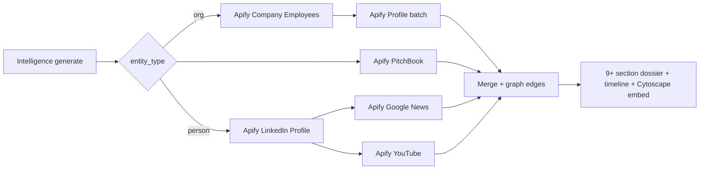

# 18th June 2026 — James Layer 2 Feedback + Apify Research + Sprint Plan

**Purpose:** Daily handoff after James reviewed Layer 1 v1.1 (17 Jun WhatsApp sent) and replied with **Layer 2 scope** — two-sided disclosure, relationship maps, media depth, LinkedIn/education, clickable entities, person timelines, visualizers, and a formal project plan. Apify researched as unified vendor for LinkedIn, PitchBook, news, and YouTube.

**Prior docs:** [17th_June.md](./17th_June.md) (v1.1 shipped) · [16th_June.md](./16th_June.md) · [README.md](./README.md)

**Staging:** Web `http://184.72.123.188:3003` · API `:3001` · Admin `:3002`  
**Branch:** `feature/us-50-state-registry-api` · **PR #2**  
**Last push:** `d2432f1` — Layer 1 v1.2 (Apify connector, two-sided LDA, graph embed, clickable entities)

**Status:** ✅ **Layer 1 v1.2 shipped 18 Jun PM** — Phase 1.2 complete. Apify **integrated in code**; enrichment **blocked** until monthly credits reset / top-up (see §16).

---

## 1) Executive summary — 18 Jun

| Area | Status |
|------|--------|
| **Layer 1 v1.2** | ✅ Shipped 18 Jun PM — Apify connector wired, two-sided LDA, graph embed, clickable entities |
| **James v1.1 review** | ✅ WhatsApp sent 17 Jun PM — James replied 18 Jun AM with **Layer 2 scope** |
| **Two-sided disclosure** | ✅ Lobbying: `client_name` + `registrant_name` LDA queries; `[CLIENT SIDE]` / `[REGISTRANT SIDE]` claims |
| **Relationship map / visualizers** | ✅ Cytoscape graph embedded on `/intelligence`; click node → investigate |
| **Key people → auto-expand** | 🔲 Not built — graph shows existing DB edges only |
| **Media (interviews, YouTube, books)** | 🟡 News section wired (Apify); YouTube/books 🔲 |
| **LinkedIn / education / colleges** | 🟡 **Code integrated** — §6 People & Education section; **empty until Apify credits** |
| **Click entity → profile** | ✅ Entity names in report trigger new investigation; graph nodes clickable |
| **Person timeline (news + social)** | 🔲 News articles in §9 when Apify active; no chronological timeline UI yet |
| **PitchBook** | 🟡 **Code integrated** — §8 PitchBook section; **empty until Apify credits** |
| **Project plan for James** | ✅ Drafted §8–§9; **WhatsApp update sent 18 Jun PM** |
| **CA / Cobalt** | ⏸️ Still deferred |

---

## 2) James conversation — 18 Jun (WhatsApp, verbatim)

### 2.1 Context — what we sent James (17 Jun PM)

v1.1 update: LDA fix (504 filings), 5-section narrative, PayPal Mafia seeds, free enrichment (Wikipedia, SEC 13G, FundedAPI). Asked for PitchBook key + PDL approval for LinkedIn/education.

### 2.2 James replies — batch 1 (18 Jun ~9:56 AM)

> "For all factos like lobbying let's disclose both sides of contracts"

> "Key people should trigger additions investigation into all related parties  
> To create a detailed relationship map"

> "What about bios, interviews, books, articles, documentaries or YouTube videos various, etc…"

> "Did we add visualizers"

### 2.3 James replies — batch 2 (18 Jun ~10:01 AM)

> "Can we do LinkedIn  
> Try and track colleges and related parties."

> "Than deep research into a time line for each person any news social media, social media mentions, etc"

> "We need to be able to click on any entity company or person; and view their information.  
> And understand there relationship, with them and other people…"

> "Ok need project plan, timelines please…. And delivery output requirements or expectations"

---

## 3) James requirements cross-verification (18 Jun)

| James said | Interpretation | Status | Evidence / gap |
|------------|----------------|--------|----------------|
| **Both sides** (lobbying, contracts, etc.) | Every factor shows both parties explicitly | ✅ **LOBBYING DONE** | LDA queries both `client_name` and `registrant_name`. Claims tagged `[CLIENT SIDE]` / `[REGISTRANT SIDE]`. Contracts still agency → recipient only. |
| **Key people → related parties → relationship map** | Auto-investigate named people; build graph | 🟡 **PARTIAL** | Embedded Cytoscape on dossier; click node to investigate. No auto-expand from narrative names yet. |
| **Bios, interviews, books, articles, documentaries, YouTube** | Rich media / public record depth | 🟡 **PARTIAL** | Wikipedia §1 + News §9 (Apify) wired; YouTube/books 🔲. Apify credits exhausted — news empty for now. |
| **Visualizers** | Charts / relationship map on dossier | ✅ **DONE** | Cytoscape graph embedded on `/intelligence` after report generate. |
| **LinkedIn — colleges, related parties** | Education + career + network | 🟡 **CODE DONE** | §6 People & Education via `apify_connector.py`. **Blocked:** Apify monthly credit limit. |
| **Person timeline** (news, social mentions) | Chronological life/career + media | 🔲 **NOT DONE** | News list in §9 when Apify active; no chronological timeline UI. |
| **Click any entity → profile + relationships** | Interactive entity explorer | ✅ **DONE** | Click entity name in report or graph node → new investigation. `/entities/[id]` still raw JSON. |
| **Project plan, timelines, delivery expectations** | Formal Layer 2 roadmap | ✅ **SENT** | §8–§9 + WhatsApp to James 18 Jun PM. |

### Overall verdict (18 Jun)

| Category | Items |
|----------|-------|
| ✅ Done (18 Jun v1.2) | Apify connector, two-sided LDA, Cytoscape embed, clickable entities, §6 LinkedIn + §8 PitchBook + §9 News sections, E2E Peter Thiel on staging, pushed `d2432f1` |
| ✅ Done (17 Jun, still valid) | LDA fix, deep narrative, PayPal Mafia seeds, free federal + Wikipedia enrichment |
| 🟡 Partial | Apify enrichment (code live, credits exhausted); contracts one-sided; key-people auto-expand; person timeline UI; YouTube/books |
| 🔲 Not done (James 18 Jun) | Key-people auto-expand, chronological person timeline, YouTube/books, network dossier, PDF, polished `/entities/[id]` UI |
| ⚠️ **Apify blocker** | Account `james97deller` STARTER plan — monthly credits exhausted (`platform-feature-disabled`). Top up at console.apify.com or wait for billing cycle reset. |

---

## 4) What was done before 18 Jun (carry-forward)

See [17th_June.md](./17th_June.md) §1–§12. Key facts:

- **Palantir:** 504 lobbying filings, $1.72B contracts, 9 sections, 13 graph edges
- **Peter Thiel:** Person dossier works; Wikipedia + Founders Fund Form D + Palantir 13G
- **PayPal Mafia seeds:** Thiel, Musk, Hoffman, Levchin, Sacks + Thiel/Defense orgs
- **Tests:** 79 passing (17 Jun)
- **WhatsApp to James:** Sent 17 Jun PM with v1.1 summary

---

## 5) Honest gap analysis vs James's vision

James wants an **ARG / Asia Defense–style network dossier** — not just a single-entity federal pull:

```
James vision                          Today (v1.2 — 18 Jun PM)
─────────────────────────────────────────────────────────────
Click any name → full profile         Click in report/graph → new investigation (profile page still raw JSON)
Relationship map on report            ✅ Cytoscape embedded on /intelligence
Both parties on every factor          ✅ Lobbying both sides; contracts still one-sided
LinkedIn colleges + related parties   🟡 §6 wired — empty until Apify credits
Person timeline + news + social       🟡 News §9 wired — no timeline UI yet
YouTube / interviews / books          Not built
PayPal Mafia as ONE network report    Individual seeds only
PDF export                            Not built
```

---

## 6) Apify research — unified vendor for Layer 2 (18 Jun)

**Decision:** Use **Apify** as primary enrichment vendor. `APIFY_API_TOKEN` is set locally in `.env` (not committed). One REST integration pattern for all actors.

### 6.1 Actor matrix (James requirements → Apify)

| James need | Apify actor | Pricing (approx) | Notes |
|------------|-------------|------------------|-------|
| **LinkedIn profiles** — education, experience | [`automation-lab/linkedin-profile-scraper`](https://apify.com/automation-lab/linkedin-profile-scraper) | ~**$0.003/profile** (~$5.20/1K); free tier ~50 profiles | No login; education array in output |
| **Company employees** | [`automation-lab/linkedin-company-employees-scraper`](https://apify.com/automation-lab/linkedin-company-employees-scraper) | ~**$0.005/employee**; cookie-free 50–100/company | Chain → profile scraper for education |
| **Bulk profile enrichment** (44 fields) | [`afanasenko/linkedin-profile-api-scraper`](https://apify.com/afanasenko/linkedin-profile-api-scraper) | **$0.03/profile** | Mode 3: decision-makers at company X |
| **PitchBook** — funding, investors, deals | [`mdataset/pitchbook-scraper`](https://apify.com/mdataset/pitchbook-scraper) | ~**$3.50/1K** (~$0.0035/lookup) | **No James API key needed** — public pages |
| **PitchBook investors** | [`crawlerbros/pitchbook-investors-scraper`](https://apify.com/crawlerbros/pitchbook-investors-scraper) | ~**$1.00/1K** | VC/PE fund profiles |
| **News / person timeline** | [`brilliant_gum/google-news-scraper`](https://apify.com/brilliant_gum/google-news-scraper) | **$0.03/article** | Person/company name queries |
| **YouTube** — interviews, documentaries | [`streamers/youtube-scraper`](https://apify.com/streamers/youtube-scraper) | ~**$5/1K videos** | Search by person name |
| **Social mentions** | [`magicfingers/social-listening-intelligence`](https://apify.com/magicfingers/social-listening-intelligence) | Pay-per-event | Reddit, HN, news, X mentions |

### 6.2 Integration pattern

```bash
POST https://api.apify.com/v2/acts/{actorId}/runs
Authorization: Bearer {APIFY_API_TOKEN}
# Poll run → GET /v2/datasets/{datasetId}/items
```

Python: `apify-client` package. **Connector shipped:** `apps/api/app/connectors/apify_connector.py` (18 Jun).

### 6.3 Cost estimate — PayPal Mafia demo spike

| Run | Items | Est. cost |
|-----|-------|-----------|
| 5 person LinkedIn profiles | 5 | ~$0.02 |
| Palantir employees (cookie-free) | ~100 | ~$0.50 |
| 5 PitchBook company lookups | 5 | ~$0.02 |
| 50 news articles × 5 people | 250 | ~$7.50 |
| 20 YouTube videos × 5 people | 100 | ~$0.50 |
| **Spike total** | | **~$8–10** |

Apify free tier: **$5/month** credit — enough for LinkedIn + PitchBook spike; news at scale needs paid plan (~$49/mo Personal).

### 6.4 Apify vs PDL (17 Jun recommendation)

| | **Apify** | **PDL** |
|---|-----------|---------|
| LinkedIn education | Live scrape ~$0.003/profile | Aggregated DB ~$0.28/lookup |
| PitchBook | ✅ Same platform | ❌ |
| News + YouTube | ✅ Same platform | ❌ |
| Legal posture | Scraping — James must sign off | Licensed API |
| **Status** | ✅ Token available — **start without James approval for spike** | Still valid fallback |

### 6.5 Legal / compliance (flag for James)

- LinkedIn actors scrape **public** profiles only; LinkedIn ToS restricts scraping — document use case and retention.
- PitchBook scrapers are community-maintained, not official PitchBook API.
- GDPR/CCPA applies to person data.

---

## 7) Revised technical approach (Apify-first)



**Recommended actor picks:**
1. `automation-lab/linkedin-profile-scraper` — person seeds (education, experience)
2. `automation-lab/linkedin-company-employees-scraper` → profile scraper — company key people
3. `mdataset/pitchbook-scraper` — replaces blocked official PitchBook key
4. `brilliant_gum/google-news-scraper` + `streamers/youtube-scraper` — media + timeline

---

## 8) Project plan — phases & timelines

**Demo anchor throughout:** PayPal Mafia (Thiel, Musk, Hoffman, Levchin, Sacks, Palantir, Founders Fund, etc.)

| Phase | Dates (est.) | Deliverable | James sees |
|-------|--------------|-------------|------------|
| **1.2** | 18 Jun ✅ | Two-sided disclosure; clickable entities in report; Cytoscape graph embed on dossier | ✅ Shipped — Peter Thiel report shows graph + both-sides lobbying section |
| **2.0** | 18 Jun 🟡 code done | Apify LinkedIn + PitchBook + News connectors; education/colleges section | **Blocked on Apify credits** — needs top-up for live LinkedIn/PitchBook/News data |
| **2.1** | 9–22 Jul (~2 wk) | Person timeline service — career + filings + news + contracts chronologically | Thiel timeline: PayPal → Palantir → news hits |
| **2.2** | 23 Jul – 5 Aug (~2 wk) | Media layer — Apify news + YouTube; books/articles where public | § Media & Public Record with cited links |
| **2.3** | 6–26 Aug (~3 wk) | Full PayPal Mafia **network dossier** (one linked report); PDF export | Single multi-entity report matching ARG style |

**Total Layer 2 estimate:** ~10 weeks to James sign-off on full vision.

---

## 9) Delivery output expectations (for James)

| # | Output | Description | Target phase |
|---|--------|-------------|--------------|
| 1 | **Entity profile page** | Click any company/person → bio, IDs, education, contracts, lobbying, investors — polished UI | 1.2 + 2.0 |
| 2 | **Relationship map** | Interactive Cytoscape graph embedded on dossier; expand on click; export PNG/JSON | 1.2 |
| 3 | **Two-sided disclosure** | Lobbying (client + firm), contracts (agency + contractor), FEC/FARA both parties | 1.2 |
| 4 | **People & education** | Colleges, career history, related parties (Apify LinkedIn) | 2.0 |
| 5 | **Person timeline** | Dated events: career, news, filings, deals, social mentions — all cited | 2.1 |
| 6 | **Media section** | Articles, interviews, YouTube, books (where public) | 2.2 |
| 7 | **9+ section dossier** | Current Layer 1 + people + media sections; DOCUMENTED/REPORTED/ANALYTICAL tags | 2.2 |
| 8 | **Network dossier** | PayPal Mafia as one linked multi-entity report | 2.3 |
| 9 | **PDF export** | Downloadable, matching James's 15 PDF examples | 2.3 |

---

## 10) Pending tasks — priority stack

### P0 — This week (Phase 1.2) — ✅ DONE 18 Jun

| # | Task | Owner | Status |
|---|------|-------|--------|
| L2.1 | Two-sided disclosure — lobbying (client + registrant LDA), contracts, FEC | — | ✅ Lobbying both sides |
| L2.2 | Clickable entity names in intelligence report → investigate | — | ✅ |
| L2.3 | Embed Cytoscape relationship graph on `/intelligence` (reuse `/graph/export`) | — | ✅ |
| L2.4 | Send James project plan + Apify approach WhatsApp | — | ✅ Sent 18 Jun PM |
| L2.5 | James sign-off on Apify scraping policy (LinkedIn + PitchBook) | James | 🔲 |
| L2.5b | **Apify account top-up** — monthly credits exhausted | James | ⚠️ **Blocker** |

### P1 — Phase 2.0 (Apify) — 🟡 Code shipped, data blocked

| # | Task | Owner | Status |
|---|------|-------|--------|
| L2.6 | `apify_connector.py` + `APIFY_API_TOKEN` in `.env.example` | — | ✅ |
| L2.7 | Apify LinkedIn profile scraper — education + experience for `entity_type=person` | — | ✅ code; ⏸️ credits |
| L2.8 | Apify company employees → key people for org reports | — | 🔲 |
| L2.9 | Apify PitchBook scraper — funding rounds + investors | — | ✅ code; ⏸️ credits |
| L2.10 | Key people extractor → auto-fetch related entities → graph edges | — | 🔲 |
| L2.11 | Spike: Peter Thiel LinkedIn URL on staging | — | ⏸️ credits |

### P2 — Layer 2 media + network

| # | Task | Status |
|---|------|--------|
| L2.12 | Apify Google News — person/company timeline events | ✅ code; ⏸️ credits |
| L2.13 | Apify YouTube — interviews, documentaries | 🔲 |
| L2.14 | Person timeline UI (merge career + filings + news) | 🔲 |
| L2.15 | Full PayPal Mafia multi-entity network report | 🔲 |
| L2.16 | PDF export matching James doc style | 🔲 |

### Done (17 Jun — do not regress)

| # | Task | Status |
|---|------|--------|
| L1.11 | LDA lobbying fix (`client_name`) | ✅ |
| L1.12 | Deep 5-section narrative | ✅ |
| L1.13 | PayPal Mafia seeds + 9-section report | ✅ |
| L1.14 | Wikipedia + FundedAPI + SEC 13G/Form D | ✅ |
| L1.18 | E2E Palantir + Peter Thiel on staging | ✅ |

### Deferred (unchanged)

| Item | Status |
|------|--------|
| CA SOS API (`calicodev.sos.ca.gov`) | ⏸️ Waiting on James |
| Cobalt Intelligence | ⏸️ Per James direction |
| OIDC Google SSO | ⏸️ Waiting on James |

---

## 11) Credentials & environment (18 Jun)

| Key | Status | Used for |
|-----|--------|----------|
| `OPENAI_API_KEY` | ✅ Set | Deep narrative |
| Federal connector keys | ✅ Set | SEC, FEC, LDA, USASpending, etc. |
| `ANTHROPIC_API_KEY` | ✅ Set | Skills (Claude) |
| `BEA_API_USER_ID` | ✅ Set | BEA economic data |
| **`APIFY_API_TOKEN`** | ✅ Set · ⚠️ **credits exhausted** | LinkedIn, PitchBook, news via `apify_connector.py` — **wired; returns empty until top-up** |
| `PITCHBOOK_API_KEY` | ❌ Not needed if Apify path | Official API optional |
| PDL API key | ❌ Not set | Fallback to Apify |
| `CA_SOS_API_KEY` | ⏸️ Deferred | James to provide |
| `COBALT_API_KEY` | ⏸️ Deferred | James to provide |
| `OIDC_*` | ❌ Missing | James to provide |

---

## 12) What we did today (18 Jun) — planning AM + build PM

| # | Activity | Output |
|---|----------|--------|
| 1 | Create this handoff (`18th_June.md`) | ✅ AM |
| 2 | Consolidate James 18 Jun messages + cross-verify | ✅ §3 |
| 3 | Document Apify actor matrix + Layer 2 plan | ✅ §6–§9 |
| 4 | **Build `apify_connector.py`** — LinkedIn, PitchBook, Google News | ✅ |
| 5 | **Two-sided LDA** — `client_name` + `registrant_name` in `intelligence_service.py` | ✅ |
| 6 | **Intelligence UI v1.2** — clickable entities, Cytoscape embed, Apify badges | ✅ |
| 7 | E2E test Peter Thiel on staging — report #15, graph 2 nodes | ✅ |
| 8 | Commit + push `d2432f1` to `feature/us-50-state-registry-api` | ✅ |
| 9 | WhatsApp update to James (v1.2 shipped + Apify credit note) | ✅ PM |
| 10 | James Apify top-up / scraping policy sign-off | 🔲 |

**Next:** Top up Apify credits → re-run Peter Thiel / Palantir for live LinkedIn + PitchBook + News data. Then L2.8 company employees + L2.10 key-people auto-expand.

---

## 13) Standup MOM — 18 Jun

### Context
- v1.1 shipped and sent to James 17 Jun PM
- James replied 18 Jun AM with Layer 2 scope (8 new requirement areas)
- Apify token available — unblocks LinkedIn + PitchBook + media without waiting on James keys

### Done (carry from 17 Jun) ✅
- LDA fix — 504 Palantir filings
- Deep 5-section narrative
- PayPal Mafia seeds + 9-section report
- Wikipedia + FundedAPI + SEC 13G
- E2E verified on staging
- Apify Store research complete (LinkedIn, PitchBook, news, YouTube actors)

### Done today (18 Jun PM) ✅
1. **Layer 1 v1.2 shipped** — Apify connector, two-sided LDA, graph embed, clickable entities
2. **E2E verified** — Peter Thiel report on staging (10 sections, embedded graph)
3. **Pushed** `d2432f1` to GitHub
4. **WhatsApp to James** — v1.2 summary + Apify credit limit note

### Next (19 Jun+) 🔨
1. James tops up Apify credits → verify LinkedIn §6, PitchBook §8, News §9 populate
2. Apify company employees scraper (L2.8) + key-people auto-expand (L2.10)
3. Person timeline UI (L2.14)
4. Contracts two-sided disclosure (agency + contractor explicit block)

### Blockers
- ⚠️ **Apify monthly credits exhausted** — `platform-feature-disabled` on all actor runs
- James sign-off on Apify scraping policy + budget for ongoing enrichment (~$50–100/mo demo scale)
- CA SOS / Cobalt / OIDC — still deferred

---

## 14) Suggested WhatsApp to James (18 Jun — project plan)

> Hi James,
>
> Thanks for the detailed feedback this morning — we've mapped everything against what's live on staging. Honest status:
>
> *Already live (v1.1):* 9-section dossier, lobbying fix (504 Palantir filings), deep narrative, PayPal Mafia seeds, federal sources + Wikipedia + investors.
>
> *Your new asks — our plan:*
>
> **1. Both sides (lobbying, contracts)** — Partial today (client + firm in lobbying text). We'll add explicit two-sided blocks and registrant-side LDA queries this week.
>
> **2. Key people → relationship map + visualizers** — Graph backend exists; not on the report yet. This week: embed interactive relationship map on every dossier + auto-expand key people.
>
> **3. LinkedIn / colleges / related parties** — Researched Apify (we have API access). Can pull education, experience, and company employees without a separate LinkedIn API key. ~$0.003/profile. Need your OK on data-use policy (scraping vs official APIs).
>
> **4. Person timeline + news + YouTube** — Same Apify platform: Google News + YouTube scrapers for articles, interviews, documentaries. Building chronological timeline merging career + filings + news.
>
> **5. Click any entity** — Entity profile API exists; we'll make every name in reports clickable → profile + relationship view.
>
> **6. PitchBook** — Can use Apify PitchBook scraper (~$0.003/lookup) without your API key, or plug in official key if you prefer.
>
> *Timeline:* ~10 weeks to full vision; PayPal Mafia as demo throughout. Phase 1.2 (this week): two-sided disclosure + clickable entities + graph visualizer.
>
> *Need from you:* (1) OK on Apify for LinkedIn/PitchBook enrichment, (2) confirm PayPal Mafia as Layer 2 sign-off demo, (3) any budget cap on API spend (~$50–100/mo at demo scale).
>
> Full written plan available on request. Happy to jump on a call.

---

## 15) Files changed (18 Jun PM — v1.2)

| File | Change |
|------|--------|
| `apps/api/app/connectors/apify_connector.py` | ✅ **NEW** — LinkedIn, PitchBook, Google News actors |
| `apps/api/app/connectors/__init__.py` | ✅ **NEW** |
| `apps/api/app/services/intelligence_service.py` | ✅ Apify wiring; two-sided LDA; §6/§8/§9 sections |
| `apps/web/pages/intelligence.js` | ✅ Clickable entities; Cytoscape embed; v1.2 UI |
| `apps/web/src/styles/Intelligence.module.css` | ✅ entityChip, apifyBadge, graphEmbed styles |
| `apps/api/pyproject.toml` | ✅ `apify-client>=3.0` |
| `.env.example` | ✅ `APIFY_API_TOKEN` documented |

**Still upcoming:**

| File | Planned change |
|------|----------------|
| `README.md` | Point to 18th_June.md; v1.2 status |
| `tests/` | Apify mock tests; LDA registrant-side tests |

---

## 16) Apify credit limit (18 Jun PM)

| Item | Detail |
|------|--------|
| **Account** | `james97deller` · STARTER plan ($39/mo, $39 usage credits) |
| **Error** | `platform-feature-disabled` — "Monthly usage hard limit exceeded" |
| **Spend observed** | ~$2.05 across 50 recent runs (prior Google search/image scraper tests) |
| **Impact** | LinkedIn, PitchBook, News actors return empty; report still generates with all free sources |
| **Fix** | Top up at [console.apify.com](https://console.apify.com) or wait for billing cycle reset |
| **Graceful fallback** | `apify_connector.py` logs warning and returns `[]` — no report failure |

---

*End of 18 June handoff — Layer 1 v1.2 shipped; Apify integrated; credits exhausted pending James top-up*
