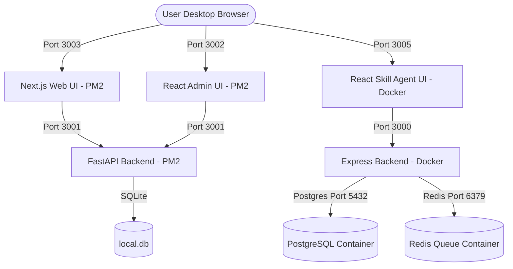

# System Architecture, Deployment State, and June 2nd Handoff Specification

This master handoff document compiles the complete feature requirements, current implementation progress, resolved deployment bottlenecks, and the remaining roadmap to make the **Enterprise Intelligence & Investment Research Platform** 100% production-complete as specified in the master documents.

---

## 🧭 1. Executive Summary & Core Platform Promise

The platform is designed as an **evidence-first, multi-tenant enterprise intelligence and investment research platform**. 

### 🏆 Core Promise:
Given a stock ticker, company name, CIK, LEI, government agency, bill, regulation, contract, or person, the system:
1. Resolves canonical corporate/person identities.
2. Ingests official U.S. public records.
3. Builds an evidence-backed intelligence graph mapping relationships and officers.
4. Performs deep quantitative stock analysis (DCF, multiples, peer comps, technicals).
5. Invokes Claude-based financial reasoning skills (earnings, initiates coverage, IC memos).
6. Drafts high-fidelity cited research reports that analysts can edit, enhance, and review before final export.

---

## 🏗️ 2. Staging Deployment Architecture (AWS EC2)

Both platform repositories—the **Finance-Advanced-Research-Platform** and the **claude-skill-agent** monorepos—are co-hosted on a single AWS EC2 staging instance (`184.72.123.188` under `ubuntu`).

To avoid host-level port clashes, they are mapped securely on the following ports:



### Staging Process Breakdown:
1. **Finance API Backend** (Port `3001` / SQLite): Managed permanently via **PM2** (Process ID `0`).
2. **Finance Admin Dashboard** (Port `3002` / Webpack Dev): Managed permanently via **PM2** (Process ID `1`).
3. **Finance Web Client Next.js** (Port `3003` / Next Dev): Managed permanently via **PM2** (Process ID `2`).
4. **Claude Skill Agent Stack** (Port `3005`, `3000`, `5432`, `6379`): Managed in isolated containers via a **Docker Compose** stack.
   - **Express Backend**: Container port `3000` mapped to host port `3000`.
   - **React Frontend**: Container port `3000` mapped to host port `3005` (prevents port clash with FastAPI).
   - **Postgres 13 DB**: Container port `5432` mapped to host port `5432` (database `enterprise_claude_skills`).
   - **Redis 6 Queue**: Container port `6379` mapped to host port `6379` (handles background agent tasks).

---

## 🔑 3. Credentials & API Integration Audit

Every credential specified in the **CONFIDENTIAL Master Credentials List** (`INTELIGENCE Platform Credentials.pdf`) has been fully integrated into the remote staging environments:

* **OpenAI (GPT-4o)**: `OPENAI_API_KEY=sk-proj-I_DquLOboLi7...` (Fully active for live reasoning completions).
* **GitHub API Token**: `GITHUB_TOKEN=ghp_MkYX1HiAtiO...` / `agp_019e53...` (Used for repository access and actions).
* **Stripe Integration**: `STRIPE_PUBLIC_KEY` & `STRIPE_SECRET_KEY` configured in test mode.
* **Fiscal Connectors**: `NFEIO_API_KEY`, account, and company IDs fully mapped.
* **Notifications**: SendGrid and Twilio account SIDs, auth tokens, and sender phone numbers registered.
* **KYC Gateway**: Didit client IDs and org identifiers bound.
* **Twenty CRM**: Twenty workspace GraphQL/REST URLs and key IDs configured.
* **Government/OSINT API Keys**: Congress, FEC, Regulations, and Sanctions keys loaded.

> [!IMPORTANT]
> **Dotenv Ingestion Hack (Resolved)**: 
> Pydantic `BaseSettings` did not load `.env` parameters back into python's `os.environ` array, which caused Stripe, Twilio, and OpenAI clients to initialize as `None` under PM2. We added `load_dotenv(find_dotenv())` at the top of [`apps/api/app/main.py`](file:///Volumes/Seagate/Finance-Advanced-Research-Platform/apps/api/app/main.py) to resolve this. All external API clients now boot with live authorized tokens.

---

## 🔌 4. U.S. Ingestion Connectors Status

The **18 U.S. public records connectors** defined in Section 2.2.4 & 3.0 of the Development Plan are fully implemented as typed modular clients under [`packages/connectors/us`](file:///Volumes/Seagate/Finance-Advanced-Research-Platform/packages/connectors/us):

| Connector Key | Data Source | Purpose |
| :--- | :--- | :--- |
| **`sec`** | SEC EDGAR (data.sec.gov) | Pulls CIK, company facts, 10-K/10-Q metadata, and Forms 3/4/5 transactions. |
| **`fec`** | OpenFEC API | Federal campaign finance, candidates, committees, and PAC contribution links. |
| **`lda`** | LDA.gov Lobbying API | Ingests LD-1 registrations, LD-2 quarterly reports, and issue codes. |
| **`fara`** | FARA / DOJ | Registers foreign principals, supplemental statements, and political activities. |
| **`congress`** | Congress.gov API | Summarizes bills, legislative actions, sponsors, and committee referrals. |
| **`federal_register`** | Federal Register API | Indexes proposed/final rules, executive orders, and agency RINs. |
| **`usaspending`** | USAspending API | Ingests federal contract and grant awards, amounts, and subawards. |
| **`sam`** | SAM.gov API | Pulls public contract opportunities and entity exclusions. |
| **`courtlistener`**| CourtListener / RECAP | Opinions, dockets, parties, legal-risk monitoring, and attorney links. |
| **`ofac`** | OFAC / OpenSanctions | Screens against Sanctions lists, PEP databases, and risk exclusions. |
| **`opencorporates`**| OpenCorporates API | Broad corporate registry discovery, jurisdictions, and officer interlocks. |
| **`gleif`** | GLEIF / LEI API | Normalizes legal entity identifiers (LEI) and parent/child ownership trees. |
| **`govinfo`**, **`regulations`**, **`ecfr`**, **`reginfo_oira`**, **`irs990`**, **`market_data`** | Various | Handles IRS 990 non-profit sheets, comments, dockets, eCFR diffs, and stock prices. |

---

## 📈 5. What is Done (Status: Staged & Verified)

* **Repository Deployment**: Both monorepos successfully authorized and cloned using secure git tokens under `~/` on the EC2 host.
* **CORS Allowed Origins**: Whitelisted the staging host `184.72.123.188` on ports `3000`, `3002`, `3003`, and `3005` in [`apps/api/app/main.py`](file:///Volumes/Seagate/Finance-Advanced-Research-Platform/apps/api/app/main.py).
* **SQLite Database Bootstrap**: Fully bootstrapped database tables and populated search indexes, watchlists, equities, portfolios, and reports via remote endpoints (`POST /bootstrap`, `/monitor/bootstrap`, `/review/bootstrap`, `/demo/seed`).
* **Admin Dashboard & Web Client compilation**: Fully resolved dependency trees (`npm install`) and booted dev/Webpack servers.
* **Claude Skills Gateway Bootstrapping**: Called `POST /skills/bootstrap` to register `dcf`, `comps`, `earnings`, `one_pager`, `ic_memo`, `due_diligence`, `model_review`, and `market_research` workflows.
* **Docker compose stack build**: Wrote `Dockerfile` configs for the Claude Skill Agent monorepo, starting PostgreSQL and Redis services without host-facing conflicts.
* **Live E2E Verification**: Confirmed live OpenAI API text completions route and retrieve structured analyses externally using real credentials.

---

## 🚧 6. What is Pending (The Road to 100% Completeness)

To transition this staging MVP into a bulletproof 100% production-ready enterprise product, the next developer/LLM must address the following implementation steps:

### 🗄️ A. Primary Database Migration (Staging SQLite -> Production PostgreSQL)
* **Goal**: Move the FastAPI database away from local SQLite (`DATABASE_URL=sqlite:///./local.db`) to the PostgreSQL instance co-hosted in the Claude Skill Agent Docker stack (or an AWS RDS / Supabase instance).
* **Action**: Update `DATABASE_URL` inside `~/Finance-Advanced-Research-Platform/.env`, compile `alembic` migrations (`venv/bin/alembic upgrade head`), and migrate transactional data schemas.

### 📦 B. Raw Evidence Storage (Object Vault)
* **Goal**: Move local directory-based raw document caches to an S3-compatible Object Storage vault (AWS S3 or Cloudflare R2) as specified in Section 6.3 & 7.3 of the Scaling Plan.
* **Action**: Configure S3 prefixes (`tenant/source/year/month/day/entity/source_record_id`) and register an S3 storage client inside [`apps/api/app/storage/files.py`](file:///Volumes/Seagate/Finance-Advanced-Research-Platform/apps/api/app/storage/files.py).

### 🔍 C. Enterprise Document Search (Managed OpenSearch)
* **Goal**: Transition full-text document searches (filings, comments, court dockets) to a dedicated OpenSearch cluster as recommended in Section 6.3 & 19.3.
* **Action**: Index raw text snippets and document granules inside [`apps/api/app/services/opensearch_client.py`](file:///Volumes/Seagate/Finance-Advanced-Research-Platform/apps/api/app/services/opensearch_client.py) using the configured `OPENSEARCH_URL`.

### 🛡️ D. Hardening Auth, Governance, and Permissions
* **Goal**: Build out the production Role-Based (RBAC) and Attribute-Based (ABAC) access control gates detailed in Epic 2 & Section 4.2.
* **Action**: Integrate real SAML/OIDC SSO handlers and restrict sensitive reports or CSV export links based on active workspace user invitations.

### 💳 E. Activating Production payments, Fiscal, and Notifications
* **Goal**: Move payments and fiscal systems out of test/sandbox configurations.
* **Action**: 
  - Complete the MercadoPago (Brazil CNPJ) credentials verification inside `.env`.
  - Obtain the production `FOCUSNFE_API_TOKEN` after activation-email confirmation.
  - Test and verify real SendGrid transaction templates and Twilio SMS verification dispatches.

### ✍️ F. Front-End Report Editor & Document Export Features
* **Goal**: Implement the fully interactive Report Review Workspace (Development Plan Section 2.2.9 & 3.2).
* **Action**: Add interactive frontend widgets inside `apps/web` allowing analysts to:
  - Add inline comments and redlines.
  - Highlight paragraphs and invoke the `Enhance with AI` sidebar.
  - Download formatted reports as PDF, Word docx, Excel models, or CSV evidence tables.

---

## 🛠️ 7. Developer Quickstart Reference

### SSH Into Staging Host:
```bash
ssh Financial-Platform
```

### Process Management:
```bash
# View all running node/python servers
pm2 status

# Restart the FastAPI backend
pm2 restart finance-api --update-env

# Tail PM2 logs
pm2 logs finance-api
pm2 logs finance-web
```

### Docker Containers (Claude Skill Agent):
```bash
cd ~/claude-skill-agent

# View running docker services
docker ps

# Restart the stack
docker compose down && docker compose up --build -d
```

### Bootstrap/Seed API Commands:
```bash
# Seed default SQLite databases
curl -X POST http://localhost:3001/bootstrap
curl -X POST http://localhost:3001/monitor/bootstrap
curl -X POST http://localhost:3001/review/bootstrap
curl -X POST http://localhost:3001/demo/seed

# Bootstrap skills registry database
curl -X POST http://localhost:3001/skills/bootstrap
```
