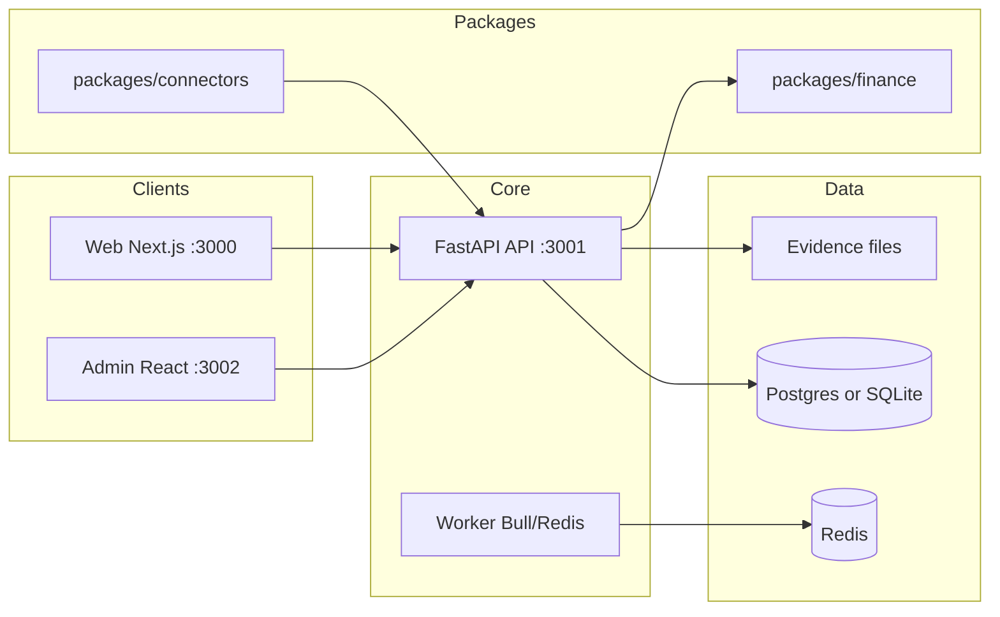

# Enterprise Intelligence & Investment Research Platform

A multi-service monorepo for **evidence-first** public-record intelligence, investment research, relationship graphs, report generation with review workflows, and portfolio monitoring.

This is **not** a stock screener or a generic LLM report tool alone. It combines market/financial analysis with U.S. public records (SEC, lobbying, procurement, litigation, sanctions, and more), entity resolution, graph intelligence, and enterprise-style collaboration.

---

## Current status

| Area | Status |
|------|--------|
| **Overall** | **Phase 3 Layer 1 v1.2 live on staging — 22 Jun 2026** |
| **Active workstream** | Layer 2: Apify enrichment (News ✅, LinkedIn ✅, PitchBook ⚠️), browser research agent next |
| **Latest handoff** | [22nd_June.md](./22nd_June.md) · [james_requirements.md](./james_requirements.md) (v2.0 requirements) |
| **Prior logs** | [18th_June.md](./18th_June.md) · [17th_June.md](./17th_June.md) |
| **E2E report** | [E2E_LIVE_VERIFICATION_REPORT.md](./E2E_LIVE_VERIFICATION_REPORT.md) — 38 FULL / 8 PARTIAL / 0 FAIL (11 Jun) |
| **Branch** | `feature/us-50-state-registry-api` → [PR #2](https://github.com/1Touch-dev/Finance-Advanced-Research-Platform/pull/2) |
| **Last push** | `d2432f1` — Layer 1 v1.2 (Apify connector, two-sided LDA, Cytoscape graph embed) |
| **Apify** | ✅ Unblocked (22 Jun) — News + LinkedIn live; PitchBook pending actor permission approval |
| **E2E (Layer 1 v1.2)** | ✅ Peter Thiel + Palantir: 9–12 sections, Google News articles, LinkedIn headline, GPT narrative |
| **Tests** | **79 passing** (`pytest tests/ -q`) |
| **Staging** | Web `http://184.72.123.188:3003` · API `:3001` · Admin `:3002` |
| **Layer 1 Intelligence** | ✅ Live — 12-section dossier · `POST /intelligence/generate` · UI at `/intelligence` |
| **Registry** | 51 jurisdictions, 202 records |
| **Connectors** | 17 federal + 51 state + BEA + Apify (News, LinkedIn, PitchBook) = **70+ total** |
| **BEA** | ✅ Live — 429 records; `/economics` page |
| **California** | BizFile scrape ✅; CA SOS API ⏸️ pending; Cobalt ⏸️ deferred |

For a detailed requirement-vs-implementation breakdown, see **[docs/REQUIREMENT_GAP_ANALYSIS.md](./docs/REQUIREMENT_GAP_ANALYSIS.md)**.  
For all James's requirements (v2.0 features, Jarvis Nexus, agent team), see **[james_requirements.md](./james_requirements.md)**.

---

## Layer 1 v1.2 — What's live (22 Jun 2026)

| # | Feature | Status |
|---|---------|--------|
| 1 | 12-section intelligence dossier (SEC, FEC, FARA, USASpending, LDA, OFAC, Courts, Wikipedia, investors, LinkedIn, PitchBook, News) | ✅ Live |
| 2 | Two-sided lobbying disclosure — `[CLIENT SIDE]` + `[REGISTRANT SIDE]` | ✅ Live |
| 3 | Two-sided contracts — `[RECIPIENT SIDE]` + `[AGENCY SIDE]` | ✅ Live (22 Jun) |
| 4 | Embedded Cytoscape relationship graph | ✅ Live |
| 5 | KPI strip — Gov Contracts, Lobbying Spend, Court Risk, Sanctions, News, Data Confidence | ✅ Live (22 Jun) |
| 6 | Filter bar — by category, source, confidence, free text | ✅ Live (22 Jun) |
| 7 | Section category labels (Financial / Government / Legal / Intelligence / Social) | ✅ Live (22 Jun) |
| 8 | Sortable tables + CSV export per section, pagination (10/page) | ✅ Live (22 Jun) |
| 9 | Click-to-investigate — any capitalized entity name in report text is clickable + auto-generates new report | ✅ Live (22 Jun) |
| 10 | Apify Google News enrichment — 47–81 articles per query | ✅ Live |
| 11 | Apify LinkedIn profile enrichment | ✅ Live |
| 12 | Apify PitchBook (realtime-scraper, no permission needed) | ✅ Live (22 Jun) |
| 13 | Browser Research Agent — `POST /intelligence/browser-research` | ✅ Live (22 Jun) |
| 14 | Argentina spike — Mercado Libre / Argentina: 4 sources, MEDIUM confidence | ✅ Tested (22 Jun) |
| 15 | GPT-4o deep narrative (5-section) | ✅ Live |
| 16 | PayPal Mafia demo seeds | ✅ Live |
| 17 | US State Registry — 51 jurisdictions | ✅ Live |

**Active branch:** `feature/layer2-kpi-filters-clickable-browser` · 4 commits today

## Layer 2 — What's next

See [james_requirements.md](./james_requirements.md) for the full prioritised backlog. Next items:

1. Apollo email intelligence pipeline (v2.0 Block A)
2. Apify social footprint — Twitter, Instagram, YouTube (v2.0 Block B)
3. Per-entity RAG chat with pgvector + Claude (v2.0 Block C)
4. Tracking dashboard + daily digest (v2.0 Block E)
5. Private company intelligence — OpenCorporates, GLEIF, FinCEN BOI (v2.0 Block F)
6. Comparison page — up to 5 entities (v2.0 Block D)
- **LDA endpoint** — migrated to `lda.gov` (lda.senate.gov decommissions Jun 30 2026)

### Try it on staging

| Resource | URL |
|----------|-----|
| **Intelligence UI** | http://184.72.123.188:3003/intelligence |
| **Home** | http://184.72.123.188:3003 |
| **API docs** | http://184.72.123.188:3001/docs |

Click any **PayPal Mafia** or **Thiel / AI / Defense** seed → **Generate Intelligence Report** (~20–45 seconds).

### Intelligence API (`/intelligence/*`)

```
POST /intelligence/generate?entity_name=&entity_type=org&ticker=   # generate cited dossier
GET  /intelligence/                                               # list recent reports
GET  /intelligence/{report_id}                                    # retrieve saved report
```

**Pipeline (v1.1):** entity name/ticker → live connectors (Wikipedia, SEC, USASpending, FEC, FARA, LDA, OFAC, CourtListener, FundedAPI, SEC 13G) → relationship graph edges → **9-section** report JSON → GPT-4o deep narrative (5-section format, 2000 tokens) → persist to DB.

### Report sections (v1.1 — 9 sections)

| # | Section | Sources |
|---|---------|---------|
| 1 | Entity Profile | Wikipedia REST + SEC EDGAR (CIK, SIC, exchange) |
| 2 | Investors & Capital Structure | SEC SC 13G/13D, Form D, FundedAPI (rounds) |
| 3 | Government Contracts & Procurement | USASpending.gov |
| 4 | Lobbying Activity **(fixed)** | LDA (client_name, lda.gov) — issues + firms |
| 5 | Political & Foreign Exposure | FEC, FARA |
| 6 | Sanctions & Compliance Check | OFAC / OpenSanctions |
| 7 | Litigation & Legal Exposure | CourtListener |
| 8 | Data Sources & Enrichment Notes | API alternatives reference |
| 9 | Deep Intelligence Narrative (AI-Generated) | GPT-4o — 5-section deep format |

Every claim tagged **DOCUMENTED** / **REPORTED** / **ANALYTICAL**.

### Live demo results — Palantir Technologies (PLTR) — v1.1

| Metric | v1 | v1.1 |
|--------|----|------|
| SEC CIK | `0001321655` | `0001321655` |
| Federal contracts | $1.72B / 10 awards | $1.72B / 10 awards |
| Lobbying filings | 10 ❌ (registrant_name bug) | **504** ✅ (client_name fixed) |
| Lobbying issue areas | — | Defense · Homeland Security · Intelligence · Financial |
| FEC | 1 PAC | 1 PAC |
| Investor filings (13G) | — | 34 institutional filings (BlackRock, etc.) |
| Peter Thiel (person demo) | — | ✅ Wikipedia bio, Founders Fund Form D, Palantir 13G links |
| Wikipedia background | — | ✅ |
| Narrative sections | 3-4 paragraphs | **5 deep sections** (Company, People, Investors, Gov, Risks) |
| Graph edges | 11 | 13 |

### Demo seeds (v1.1 — two groups)

**PayPal Mafia:** Peter Thiel · Elon Musk · Reid Hoffman · Max Levchin · David Sacks  
**Thiel / AI / Defense:** Palantir Technologies · Anduril Industries · Founders Fund · HawkEye 360 · Redwire Corporation

### Free enrichment APIs integrated (no extra keys)

| API | What it adds | Cost |
|-----|-------------|------|
| **Wikipedia REST** | Company background, founders, products | Free, no key |
| **FundedAPI** | Startup funding rounds, investors | Free — 60 req/hr / 100/day |
| **SEC EDGAR (SC 13G/13D, Form D)** | Institutional ownership + private placements | Free with User-Agent |
| **LDA.gov** | Lobbying by client_name; replaces lda.senate.gov Jun 30 | Free |

### Layer 1 code (v1.1)

| File | Role |
|------|------|
| `apps/api/app/api/intelligence.py` | REST router — generate, list, retrieve |
| `apps/api/app/services/intelligence_service.py` | Orchestrator + 10 connectors (SEC, FEC, FARA, USASpending, LDA, OFAC, courts, Wikipedia, FundedAPI, SEC investors) |
| `apps/web/pages/intelligence.js` | Report generator UI — PayPal Mafia + Thiel/Defense seeds, 9-section viewer |
| `apps/web/src/styles/Intelligence.module.css` | Intelligence page styles |

### E2E verified (17 Jun 2026)

| Flow | Result |
|------|--------|
| `/intelligence` page load + nav | ✅ |
| PayPal Mafia seeds → Peter Thiel report | ✅ 9 sections, ~45 sec |
| Thiel/Defense seeds → Palantir report | ✅ 504 lobbying filings, $1.72B contracts |
| Home → Intelligence navigation | ✅ |
| `GET /intelligence/` | ✅ 10+ reports persisted |

### Still pending (Layer 1 v2)

- PDF export matching James doc style
- Multi-entity PayPal Mafia network graph report (cross-entity linking)
- PitchBook connector (requires James API key)
- LinkedIn / people enrichment (PDL free tier or NinjaPear — needs James approval)
- Ownership tree crawler (OpenOwnership / FinCEN BOI)
- Officer cross-entity matching

Full handoffs: **[17th_June.md](./17th_June.md)** · **[16th_June.md](./16th_June.md)**

---

## Phase 2 — U.S. 50-State Registry + BEA (11 June 2026)

James Thunder Marketing's all-50-states registry program is now implemented.

### Registry API (`/registry/*`)

```
GET  /registry/health               # 51/51 live count + tier distribution
GET  /registry/jurisdictions        # all 51 with tier, SOS URL, record count
GET  /registry/search?q=&state=     # search normalized records
GET  /registry/entity/{jur}/{eid}   # single entity detail
POST /registry/keys                 # admin: create API key
```

Auth: `X-Registry-Api-Key` header or `?api_key=` query param. Rate limit: 100 req/min per key.

### Ingestion tiers

| Tier | States | Method | Status |
|------|--------|--------|--------|
| **A — Bulk** | NY, CO, FL, OR | data.ny.gov, data.colorado.gov, Sunbiz HTTP, data.oregon.gov | ✅ Live |
| **B — API** | WA, TX, CA | WA SOS API, TX Comptroller, CA SOS CBC API | ⏸️ CA key pending |
| **B2 — BizFile scrape** | CA (interim) | Playwright scrape of official BizFile Online | ✅ Live (~150/run) |
| **D — Scrape** | 44 remaining states + DC | GenericScrapedStateConnector + Playwright | ✅ Live |
| **E — Cobalt** | Scrape states + CA interim | `COBALT_API_KEY` | ⏸️ Deferred (trial 429) |

### BEA connector (#18)

```bash
# Signup: https://apps.bea.gov/API/signup/
BEA_API_USER_ID=your-uuid-here  # in .env
```

Fetches NIPA GDP, Regional personal income, industry data. Enriches `analyze_stock`.

### New env vars

```bash
BEA_API_USER_ID=          # free BEA API key (live on staging)
CA_SOS_API_KEY=           # CA SOS Primary key from calicodev.sos.ca.gov/profile (pending approval)
COBALT_API_KEY=           # Cobalt SOS API — trial at app.cobaltintelligence.com
COBALT_LIVE_DATA=false    # use cached SOS data (saves trial/paid credits)
REGISTRY_API_ADMIN_TOKEN= # optional bootstrap admin key for /registry/keys
REGISTRY_REQUIRE_AUTH=    # set to "true" to enforce API key auth
```

**CA SOS signup:** [calicodev.sos.ca.gov](https://calicodev.sos.ca.gov/) → Products → **CBC API Production** → Subscribe → Primary key when **Active**.

### Seeding

```bash
bash scripts/seed-state-registry.sh          # all 51 jurisdictions
bash scripts/seed-state-registry.sh us_ny us_co  # specific states
```

---

## What it does today

- **Generate Layer 1 intelligence reports** — enter entity/person → live Wikipedia, SEC, USASpending, FEC, FARA, LDA (client), OFAC, CourtListener, FundedAPI → **9-section** cited dossier + deep GPT narrative (`/intelligence`)
- **Resolve & search** entities (companies, people, agencies) with aliases and identifiers
- **Store evidence** — raw documents, hashes, and `EvidenceRef` citations
- **Build relationship graphs** — expand, pathfind, related-party scoring; intelligence reports write edges per run
- **U.S. 50-state registry** — search 51 jurisdictions, 202 normalized records (`/registry`)
- **Run finance workflows** — stock analysis, DCF, comps, fundamentals (via `packages/finance`)
- **Draft & review reports** — sections, claims, claim verification, comments, exports (Markdown/HTML/JSON)
- **Monitor** — watchlists, portfolios (CSV import), alert rules, scan/deliver (webhook + email/SMS)
- **Ingest (production ETL)** — 17 U.S. connectors with live APIs; sample data only in `ENV=test`
- **Skills gateway** — Anthropic adapter (Claude) with OpenAI fallback; artifact persistence + cost logging
- **BEA economics** — GDP, regional income data on `/economics`
- **Exports** — PDF, Word, Markdown, HTML, JSON + evidence CSV appendix (legacy reports)
- **SSO** — Google OIDC routes wired (credentials pending from client)
- **Admin** — source health dashboard with per-source status and run history

---

## Architecture (high level)



| Layer | Technology |
|-------|------------|
| API | FastAPI, SQLAlchemy, JWT auth, RBAC |
| Web | Next.js 12, React 17 |
| Admin | Create React App, React 17 |
| Worker | Node, Bull, Redis |
| DB (local default) | SQLite (`apps/api/local.db`) |
| DB (Docker) | PostgreSQL 13 |
| Queue | Redis 6 |

---

## Repository structure

```
Finance-Advanced-Research-Platform/
├── apps/
│   ├── api/          # FastAPI — all REST domains
│   │   └── app/
│   │       ├── api/intelligence.py      # Layer 1 intelligence API
│   │       └── services/intelligence_service.py  # Report orchestrator
│   ├── web/          # Next.js research UI (+ /intelligence page)
│   ├── admin/        # React ops / health dashboard
│   └── worker/       # Background jobs (Bull)
├── packages/
│   ├── finance/      # DCF, comps, technicals, market helpers
│   ├── connectors/   # U.S. public-data connectors + SDK (17 federal + 51 state + BEA)
│   └── reporting/    # Report templates (JSON)
├── scripts/
│   ├── local-start.ps1
│   ├── local-stop.ps1
│   ├── seed-state-registry.sh
│   └── docker-up.ps1
├── docs/             # Setup, gap analysis, demo data, Phase 1 readiness
├── memory/           # Project context & architecture notes
├── 17th_June.md      # Latest daily handoff (Layer 1 v1.1 — lobbying fix, PayPal Mafia, E2E)
├── 16th_June.md      # Layer 1 v1 ship status
├── tests/            # API + connector tests
├── docker-compose.yml
├── SETUP.md
└── .env.example
```

---

## Implemented modules (API)

| Module | Prefix | Notes |
|--------|--------|--------|
| **Intelligence (Layer 1)** | `/intelligence` | 9-section entity network dossiers — generate, list, retrieve; PayPal Mafia seeds |
| Identity & workspace | `/`, `/auth`, `/orgs`, `/workspaces` | Orgs, roles, projects, cases, audit |
| **Registry** | `/registry` | 51 jurisdictions, search, entity detail, API keys |
| Evidence vault | `/evidence` | Raw upload, refs, file storage |
| Entities & resolution | `/entities` | CRUD, resolve, merge queue |
| Search | `/search` | Global search, entity profile, timeline |
| OpenSearch (stub) | `/searchos` | Index stub + hybrid fallback |
| Graph | `/graph` | Expand, path, related, edge evidence |
| Finance | `/finance` | Analyze stock, DCF, comps, fundamentals |
| Sources | `/sources` | Registry, runs, contracts |
| Reports | `/reports` | Reports, claims, bundles, verify (legacy CRUD) |
| Review | `/review` | Comments, suggestions, exports |
| Skills | `/skills` | Skill registry + runs (Anthropic/OpenAI) |
| Monitor | `/monitor` | Watchlists, portfolios, alerts |
| Compliance | `/compliance` | Policies, export approvals |
| Demo | `/demo` | `POST /demo/seed` — sample data for UI |

Interactive API docs (when API is running): **http://localhost:3001/docs**

---

## U.S. connectors (`packages/connectors`)

**17 federal connectors** — live on staging with real API ingestion:

SEC EDGAR, FEC, LDA, FARA, Congress.gov, GovInfo, Federal Register, Regulations.gov, eCFR, RegInfo/OIRA, USAspending, SAM.gov, IRS 990, CourtListener, OFAC, OpenCorporates, GLEIF.

**Layer 1 intelligence service** runs entity-specific queries against Wikipedia, SEC (incl. 13G/13D/Form D), FEC, FARA, USASpending, LDA (`client_name` via lda.gov), OFAC, CourtListener, and FundedAPI per report generation (see `apps/api/app/services/intelligence_service.py`).

**51 state registry connectors** + **BEA** — bulk/API/scrape tiers; CA BizFile Playwright scrape as interim free official source.

Source contracts (YAML) are under `packages/connectors/us/*/source_contract.yml` where defined.

---

## Web UI routes

| Route | Purpose |
|-------|---------|
| `/` | Home + navigation cards |
| **`/intelligence`** | **Layer 1 Entity Network Report generator** — PayPal Mafia + Thiel/Defense seeds, 9-section cited dossier viewer |
| `/search` | Global search |
| `/graph` | Graph visualization (entity ID) |
| `/registry` | U.S. 50-state company registry search (51 jurisdictions) |
| `/economics` | BEA economic data — GDP, regional income (live connector) |
| `/stock` | Stock analysis |
| `/skills` | Skills runner (Anthropic/OpenAI) |
| `/entities/[id]` | Entity profile |
| `/entities/merge` | Entity merge queue |
| `/portfolio/[id]` | Portfolio exposure |
| `/review/[id]` | Report review workspace |
| `/alerts` | Alert inbox |

---

## Quick start

### Prerequisites

- **Python 3.11+**
- **Node.js 18+**
- **Redis** (optional — only for `apps/worker`)

### Option A — Local without Docker (recommended on Windows)

From this directory:

```powershell
.\scripts\local-start.ps1
```

Stop:

```powershell
.\scripts\local-stop.ps1
```

Uses **SQLite** by default (see `.env`). No PostgreSQL install required.

### Option B — Docker

Requires [Docker Desktop](https://www.docker.com/products/docker-desktop/).

```powershell
.\scripts\docker-up.ps1
```

Or manually:

```powershell
docker compose up --build -d
curl.exe -X POST http://localhost:3001/bootstrap
```

### Service URLs

| Service | Local | Staging (EC2) |
|---------|-------|----------------|
| Web | http://localhost:3000 | http://184.72.123.188:3003 |
| **Intelligence UI** | http://localhost:3000/intelligence | http://184.72.123.188:3003/intelligence |
| API | http://localhost:3001 | http://184.72.123.188:3001 |
| API health | http://localhost:3001/health | http://184.72.123.188:3001/health |
| Admin | http://localhost:3002 | http://184.72.123.188:3002 |

---

## Demo data

Populate sample entities, graph links, a report, watchlist, and portfolio:

```powershell
curl.exe -X POST http://127.0.0.1:3001/demo/seed
```

Then try:

- http://localhost:3000/intelligence → click **Palantir Technologies** or **Peter Thiel** → **Generate Intelligence Report**
- http://localhost:3000/search → query `apple`
- http://localhost:3000/entities/1
- http://localhost:3000/graph → entity ID `1`
- http://localhost:3000/registry → search state registry records
- http://localhost:3000/portfolio/1
- http://localhost:3000/review/1

Details: **[docs/DEMO_DATA.md](./docs/DEMO_DATA.md)**

---

## Manual setup (API only)

```powershell
cd apps\api
pip install -e .
pip install -e "..\..\packages\finance"
$env:DATABASE_URL = "sqlite:///./local.db"
python -m uvicorn app.main:app --host 127.0.0.1 --port 3001
```

Bootstrap DB tables:

```powershell
curl.exe -X POST http://127.0.0.1:3001/bootstrap
```

Install web/admin per app (`npm install` inside `apps/web` and `apps/admin`). Root `npm install` can fail on some Windows setups — install per app instead.

Full instructions: **[SETUP.md](./SETUP.md)**

---

## Environment variables

Copy `.env.example` to `.env` at the repo root.

| Variable | Purpose |
|----------|---------|
| `DATABASE_URL` | `sqlite:///./local.db` (local) or Postgres URL (Docker) |
| `NEXT_PUBLIC_API_URL` | Web → API base (default `http://localhost:3001`) |
| `REACT_APP_API_URL` | Admin → API base |
| `REDIS_URL` | Worker queue |
| `JWT_SECRET` | API token signing |
| `OPENAI_API_KEY` | Layer 1 GPT-4o narrative generation |
| `FEC_API_KEY` | FEC OpenData (Layer 1 + connector) |
| `COURTLISTENER_API_TOKEN` | CourtListener litigation search |
| `SEC_USER_AGENT` | SEC EDGAR User-Agent header (required by SEC) |
| `BEA_API_USER_ID` | BEA economic data |
| `CA_SOS_API_KEY` | CA SOS CBC API (pending approval) |
| `COBALT_API_KEY` | Cobalt SOS API (deferred — trial capped) |
| `OIDC_CLIENT_ID` / `OIDC_CLIENT_SECRET` | Google Workspace SSO (pending from client) |

See `.env.example` for the full list of 17+ connector keys.

---

## Testing

```powershell
# From repo root (with API deps installed)
pytest tests/
```

Coverage is **minimal** today (health stubs + connector sample runs). See gap analysis for testing roadmap.

---

## Documentation

| Document | Description |
|----------|-------------|
| [17th_June.md](./17th_June.md) | **Latest** — v1.1 ship: LDA fix, deep narrative, PayPal Mafia, E2E results, API research |
| [16th_June.md](./16th_June.md) | Layer 1 v1 ship status, Palantir demo, James sign-off |
| [15th_June.md](./15th_June.md) | Phase 3 planning, 15 intelligence PDF review, BizFile |
| [12th_June.md](./12th_June.md) | Cobalt + CA SOS registry work |
| [PHASE2_COMPLETION_REPORT.md](./PHASE2_COMPLETION_REPORT.md) | 50-state registry completion |
| [SETUP.md](./SETUP.md) | Local + Docker setup, troubleshooting |
| [docs/DEMO_DATA.md](./docs/DEMO_DATA.md) | Demo seed and UI tour |
| [docs/REQUIREMENT_GAP_ANALYSIS.md](./docs/REQUIREMENT_GAP_ANALYSIS.md) | Spec vs repo, priorities |
| [docs/PHASE1_READINESS.md](./docs/PHASE1_READINESS.md) | Phase 1 checklist |
| [memory/](./memory/) | Project context, architecture, progress |

---

## Known limitations

**Layer 1 (v1.1 — current)**
- No PDF export for intelligence dossiers yet (UI + JSON only)
- Single-entity reports only — full multi-node PayPal Mafia graph not wired
- PitchBook + LinkedIn/people enrichment pending James approval (PDL evaluated)
- No ownership tree crawler (OpenOwnership / FinCEN BOI)
- Officer cross-entity matching not implemented
- Registry not yet used as intelligence report entry point
- OFAC name matching can produce false positives (needs tuning)
- SEC 13G search returns related filings in EDGAR full-text (not always direct holders of subject entity)

**Platform (general)**
- Claim verification and legacy review flows are basic, not full enterprise governance
- OIDC/Google SSO wired but credentials pending from client
- OpenSearch integration is largely a stub
- Admin UI is an operations shell, not full tenant administration
- Cobalt and CA SOS API deferred per client direction

---

## Product principles (from spec)

1. **Evidence first** — conclusions should trace to sources  
2. **Official APIs first** — scraping only when necessary  
3. **Human review** for sensitive outputs  
4. **Multi-tenant governance** — permissions, audit, versioning  
5. **Cost-aware architecture** — right storage for the job  

---

## Contributing

1. Read [docs/REQUIREMENT_GAP_ANALYSIS.md](./docs/REQUIREMENT_GAP_ANALYSIS.md) for current gaps  
2. Follow existing patterns in `apps/api/app/api/` and `packages/`  
3. Prefer focused PRs per module (connectors, evidence, review, etc.)  

---

## License

See repository license file if present; otherwise treat as private/internal until specified.
