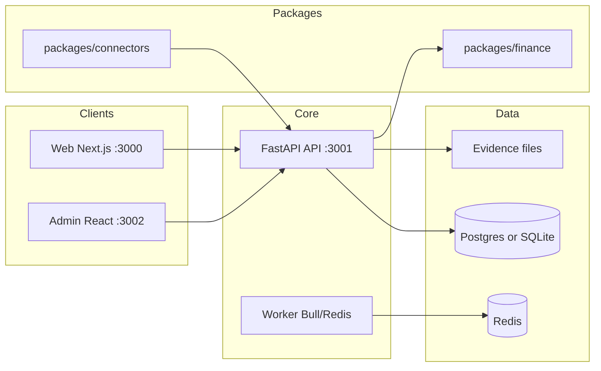

# Enterprise Intelligence & Investment Research Platform

A multi-service monorepo for **evidence-first** public-record intelligence, investment research, relationship graphs, report generation with review workflows, and portfolio monitoring.

This is **not** a stock screener or a generic LLM report tool alone. It combines market/financial analysis with U.S. public records (SEC, lobbying, procurement, litigation, sanctions, and more), entity resolution, graph intelligence, and enterprise-style collaboration.

---

## Current status

| Area | Status |
|------|--------|
| **Overall** | Phase 1 U.S. MVP **~75–80%** — live connectors, production ETL runner, staging deployed |
| **Branch** | `feature/phase1-us-mvp-100pct` → PR to `integration/phase1-mvp-base` |
| **Tests** | 31 passing (`pytest tests/ -q`) |
| **Staging** | Web `:3003` · API `:3001` · Admin `:3002` on `184.72.123.188` |
| **Local dev** | SQLite default; Postgres + MinIO + OpenSearch via `docker compose` |

For a detailed requirement-vs-implementation breakdown, see **[docs/REQUIREMENT_GAP_ANALYSIS.md](./docs/REQUIREMENT_GAP_ANALYSIS.md)**.

---

## What it does today

- **Resolve & search** entities (companies, people, agencies) with aliases and identifiers
- **Store evidence** — raw documents, hashes, and `EvidenceRef` citations
- **Build relationship graphs** — expand, pathfind, related-party scoring
- **Run finance workflows** — stock analysis, DCF, comps, fundamentals (via `packages/finance`)
- **Draft & review reports** — sections, claims, claim verification, comments, exports (Markdown/HTML/JSON)
- **Monitor** — watchlists, portfolios (CSV import), alert rules, scan/deliver (webhook + stubs)
- **Ingest (production ETL)** — 17 U.S. connectors with live APIs; sample data only in `ENV=test`; runner persists raw + EvidenceRef
- **Skills gateway** — live Anthropic adapter (Claude) with OpenAI fallback; artifact persistence + cost logging
- **Alerts** — real connector-delta scan, SendGrid email + Twilio SMS delivery, alert inbox UI
- **Exports** — PDF, Word, Markdown, HTML, JSON + evidence CSV appendix
- **SSO** — Google OIDC routes + JWT refresh/revocation
- **Admin** — source health dashboard with per-source status and run history

---

## Architecture (high level)



| Layer | Technology |
|-------|------------|
| API | FastAPI, SQLAlchemy, JWT auth, RBAC |
| Web | Next.js 12, React 17 |
| Admin | Create React App, React 17 |
| Worker | Node, Bull, Redis |
| DB (local default) | SQLite (`apps/api/local.db`) |
| DB (Docker) | PostgreSQL 13 |
| Queue | Redis 6 |

---

## Repository structure

```
Finance-Advanced-Research-Platform/
├── apps/
│   ├── api/          # FastAPI — all REST domains
│   ├── web/          # Next.js research UI
│   ├── admin/        # React ops / health dashboard
│   └── worker/       # Background jobs (Bull)
├── packages/
│   ├── finance/      # DCF, comps, technicals, market helpers
│   ├── connectors/   # U.S. public-data connectors + SDK
│   └── reporting/    # Report templates (JSON)
├── scripts/
│   ├── local-start.ps1
│   ├── local-stop.ps1
│   └── docker-up.ps1
├── docs/             # Setup, gap analysis, demo data, Phase 1 readiness
├── memory/           # Project context & architecture notes
├── tests/            # API + connector tests (minimal today)
├── docker-compose.yml
├── SETUP.md
└── .env.example
```

---

## Implemented modules (API)

| Module | Prefix | Notes |
|--------|--------|--------|
| Identity & workspace | `/`, `/auth`, `/orgs`, `/workspaces` | Orgs, roles, projects, cases, audit |
| Evidence vault | `/evidence` | Raw upload, refs, file storage |
| Entities & resolution | `/entities` | CRUD, resolve, merge queue |
| Search | `/search` | Global search, entity profile, timeline |
| OpenSearch (stub) | `/searchos` | Index stub + hybrid fallback |
| Graph | `/graph` | Expand, path, related, edge evidence |
| Finance | `/finance` | Analyze stock, DCF, comps, fundamentals |
| Sources | `/sources` | Registry, runs, contracts |
| Reports | `/reports` | Reports, claims, bundles, verify |
| Review | `/review` | Comments, suggestions, exports |
| Skills | `/skills` | Skill registry + runs (internal/Anthropic stub) |
| Monitor | `/monitor` | Watchlists, portfolios, alerts |
| Compliance | `/compliance` | Policies, export approvals |
| Demo | `/demo` | `POST /demo/seed` — sample data for UI |

Interactive API docs (when API is running): **http://localhost:3001/docs**

---

## U.S. connectors (`packages/connectors`)

Connector skeletons and tests exist for:

SEC EDGAR, FEC, LDA, FARA, Congress.gov, GovInfo, Federal Register, Regulations.gov, eCFR, RegInfo/OIRA, USAspending, SAM.gov, IRS 990, CourtListener, OFAC, OpenCorporates, GLEIF.

Source contracts (YAML) are under `packages/connectors/us/*/source_contract.yml` where defined.

---

## Web UI routes

| Route | Purpose |
|-------|---------|
| `/` | Home + navigation cards |
| `/search` | Global search |
| `/graph` | Graph visualization (entity ID) |
| `/stock` | Stock analysis |
| `/skills` | Skills runner |
| `/entities/[id]` | Entity profile |
| `/portfolio/[id]` | Portfolio exposure |
| `/review/[id]` | Report review workspace |

---

## Quick start

### Prerequisites

- **Python 3.11+**
- **Node.js 18+**
- **Redis** (optional — only for `apps/worker`)

### Option A — Local without Docker (recommended on Windows)

From this directory:

```powershell
.\scripts\local-start.ps1
```

Stop:

```powershell
.\scripts\local-stop.ps1
```

Uses **SQLite** by default (see `.env`). No PostgreSQL install required.

### Option B — Docker

Requires [Docker Desktop](https://www.docker.com/products/docker-desktop/).

```powershell
.\scripts\docker-up.ps1
```

Or manually:

```powershell
docker compose up --build -d
curl.exe -X POST http://localhost:3001/bootstrap
```

### Service URLs

| Service | URL |
|---------|-----|
| Web | http://localhost:3000 |
| API | http://localhost:3001 |
| API health | http://localhost:3001/health |
| Admin | http://localhost:3002 |

---

## Demo data

Populate sample entities, graph links, a report, watchlist, and portfolio:

```powershell
curl.exe -X POST http://127.0.0.1:3001/demo/seed
```

Then try:

- http://localhost:3000/search → query `apple`
- http://localhost:3000/entities/1
- http://localhost:3000/graph → entity ID `1`
- http://localhost:3000/portfolio/1
- http://localhost:3000/review/1

Details: **[docs/DEMO_DATA.md](./docs/DEMO_DATA.md)**

---

## Manual setup (API only)

```powershell
cd apps\api
pip install -e .
pip install -e "..\..\packages\finance"
$env:DATABASE_URL = "sqlite:///./local.db"
python -m uvicorn app.main:app --host 127.0.0.1 --port 3001
```

Bootstrap DB tables:

```powershell
curl.exe -X POST http://127.0.0.1:3001/bootstrap
```

Install web/admin per app (`npm install` inside `apps/web` and `apps/admin`). Root `npm install` can fail on some Windows setups — install per app instead.

Full instructions: **[SETUP.md](./SETUP.md)**

---

## Environment variables

Copy `.env.example` to `.env` at the repo root.

| Variable | Purpose |
|----------|---------|
| `DATABASE_URL` | `sqlite:///./local.db` (local) or Postgres URL (Docker) |
| `NEXT_PUBLIC_API_URL` | Web → API base (default `http://localhost:3001`) |
| `REACT_APP_API_URL` | Admin → API base |
| `REDIS_URL` | Worker queue |
| `JWT_SECRET` | API token signing |

---

## Testing

```powershell
# From repo root (with API deps installed)
pytest tests/
```

Coverage is **minimal** today (health stubs + connector sample runs). See gap analysis for testing roadmap.

---

## Documentation

| Document | Description |
|----------|-------------|
| [SETUP.md](./SETUP.md) | Local + Docker setup, troubleshooting |
| [docs/DEMO_DATA.md](./docs/DEMO_DATA.md) | Demo seed and UI tour |
| [docs/REQUIREMENT_GAP_ANALYSIS.md](./docs/REQUIREMENT_GAP_ANALYSIS.md) | Spec vs repo, priorities |
| [docs/PHASE1_READINESS.md](./docs/PHASE1_READINESS.md) | Phase 1 checklist |
| [memory/](./memory/) | Project context, architecture, progress |

---

## Known limitations (Phase 1)

- Many connectors return **sample/fixture** data, not live production ingestion
- Claim verification and review flows are **basic**, not full enterprise governance
- No SSO/SCIM/MFA yet
- OpenSearch integration is largely a **stub**
- Alert delivery (email/Slack/Teams) are **placeholders**
- Admin UI is an **operations shell**, not full tenant administration

---

## Product principles (from spec)

1. **Evidence first** — conclusions should trace to sources  
2. **Official APIs first** — scraping only when necessary  
3. **Human review** for sensitive outputs  
4. **Multi-tenant governance** — permissions, audit, versioning  
5. **Cost-aware architecture** — right storage for the job  

---

## Contributing

1. Read [docs/REQUIREMENT_GAP_ANALYSIS.md](./docs/REQUIREMENT_GAP_ANALYSIS.md) for current gaps  
2. Follow existing patterns in `apps/api/app/api/` and `packages/`  
3. Prefer focused PRs per module (connectors, evidence, review, etc.)  

---

## License

See repository license file if present; otherwise treat as private/internal until specified.
