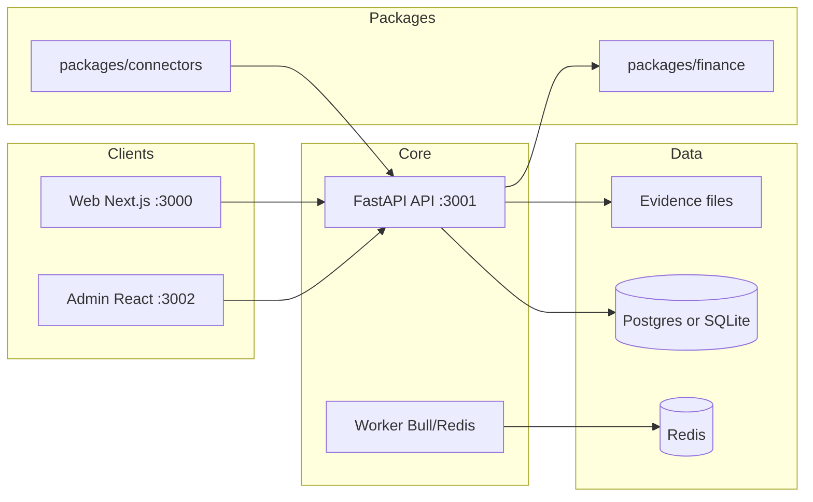

# Enterprise Intelligence & Investment Research Platform

A multi-service monorepo for **evidence-first** public-record intelligence, investment research, relationship graphs, report generation with review workflows, and portfolio monitoring.

This is **not** a stock screener or a generic LLM report tool alone. It combines market/financial analysis with U.S. public records (SEC, lobbying, procurement, litigation, sanctions, and more), entity resolution, graph intelligence, and enterprise-style collaboration.

---

## Current status

| Area | Status |
|------|--------|
| **Overall** | **29 Jul 2026 — Trade alerts live (F-03/F-04) · Full platform · 60+ endpoints** |
| **Active branch** | `feature/trade-alerts` |
| **Full handoff** | **[Finance_Platform_Handoff.md](./Finance_Platform_Handoff.md)** ← **START HERE for new teammates** |
| **API integrations** | **[docs/API_INTEGRATIONS_GUIDE.md](./docs/API_INTEGRATIONS_GUIDE.md)** — all external APIs (why / how they help) |
| **Sprint log** | [5th_July.md](./5th_July.md) |
| **Big Trade Alerts (F-03)** | ✅ SEC Form 4 scan · threshold · email/SMS · PM2 every 4h · UI at `/tracking` |
| **Investment Alerts (F-04)** | ✅ Per-watchlist threshold · Form 4 + 13F · personal email/SMS · PM2 every 4h |
| **RSS Worker** | ✅ 50 feeds · PM2 rss-poller · 2000+ articles · 15-min cycle |
| **Crypto Intelligence** | ✅ CoinGecko · ETH/BTC wallets · Whale alerts · TTL cache |
| **Gov Trading** | ✅ House PTR · SEC Form 4 · Politician tracker |
| **Deep Company** | ✅ SEC XBRL · Cap table · Analyst · Earnings |
| **Valuation** | ✅ DCF model · 10-K/10-Q filing analysis · Bear/Base/Bull scenarios |
| **Expert Analysis** | ✅ News sentiment · Themes · Analyst upgrade timeline |
| **Institutional (13F)** | ✅ Holders · Mutual funds · 13F filers · Institution lookup |
| **Multi-Agent AI** | ✅ Fundamentals · Technical · Sentiment · Risk → BUY/HOLD/SELL |
| **UI/UX** | ✅ Dark sidebar · Tailwind design system · All pages redesigned (8 Jul) |
| **Apollo.io** | ✅ Paid plan live · Org enrichment · People · Org chart |
| **Staging** | Web `http://184.72.123.188:3003` · API `:3001` · Admin `:3002` · Docs `:3001/docs` |
| **Local web** | `http://localhost:3003` (API `:3001`) |
| **Nav pages** | 22+ pages: Dashboard, Intelligence, Saved, Stock, Valuation, Company, Expert, Institutional, Crypto, Gov Trading, Economics, Search, Graph, Registry, Timeline, Compare, Tracking, Alerts, Skills |

### ✅ v2.0 Features Shipped + Verified (22 Jun)

| # | Feature | Details |
|---|---------|---------|
| 1 | KPI Dashboard View | Toggle between Full Report and KPI Dashboard on intelligence reports |
| 2 | Apollo org enrichment | `GET /intelligence/apollo/org`, `POST /apollo/enrich`; name-based search, credit-exhaustion fallback |
| 3 | Apify social footprint | Twitter/X, Instagram, YouTube scrapers + social section in every report |
| 4 | Private company intel | OpenCorporates (global registry) + GLEIF (LEI) + FinCEN + FDIC |
| 5 | Per-entity RAG chat | Floating chat panel on reports — cited Q&A via `POST /chat/ask`; works without report too |
| 6 | Tracking dashboard | Watchlist + daily digest worker + SendGrid/Twilio alerts at `/tracking` (+ F-03/F-04 big-trade & investment alerts) |
| 7 | Polished `/entities/[id]` | Tabs: Overview, Relationships, Evidence, Timeline, Related. Aliases/identifiers as chips |
| 8 | Person timeline | `/timeline` page — vertical + card view, 3 demo entities, filter by category |
| 9 | FEC/FARA two-sided | FEC as registrant + as contributor; FARA as registrant + as foreign principal |
| 10 | Comparison page | `/compare` — up to 5 entities, radar chart, KPI table, shared-entity overlap |
| 11 | Apify key people | Company employee scraper → Key People section + auto graph edges |
| 12 | PDF export | `GET /intelligence/{id}/pdf` — polished multi-page ReportLab PDF + ⬇ PDF button |
| 13 | Graph export | PNG (Cytoscape) + JSON export buttons on embedded graph |
| 14 | Report reconstruction | `get_intelligence_report` rebuilds nested claims-per-section from DB storage |

### ✅ 23 Jun — P1 + P2 + P3 Shipped

| # | Feature | Details |
|---|---------|---------|
| 15 | Entity profile 9-tab layout | Financial (revenue charts, Beneish M-Score, Altman Z-Score, insider transactions), People & Contacts (Apollo), Social & News footprint, RAG Chat — added to existing 5 tabs |
| 16 | API Status Panel | Per-source live/down indicator on entity profile header |
| 17 | Add to Tracking button | On every entity profile and intelligence report |
| 18 | Intelligence: 4 view modes | Report + KPI Dashboard + Timeline View (all claims chronologically) + Graph View (embedded Cytoscape) |
| 19 | Date-range filter | All time / Last 1yr / Last 30d chips on report view |
| 20 | Search highlight | Matching claims highlighted yellow when using search filter |
| 21 | Word export | `GET /intelligence/{id}/word` → .docx download (python-docx) |
| 22 | Excel export | `GET /intelligence/{id}/excel` → .xlsx download (openpyxl) |
| 23 | PowerPoint export | `GET /intelligence/{id}/powerpoint` → .pptx download (python-pptx) |
| 24 | `/intelligence/{id}` page | Dedicated report page per saved report with all export buttons |
| 25 | `/tracking/alerts` page | Alert inbox — severity filter, acknowledge, snooze 24h |
| 26 | `/saved` page | Saved reports library with search + direct PDF/Word/Excel export |
| 27 | Navigation updated | Saved + Tracking/Alerts in main nav |
| 28 | PM2 cron | `daily-digest` scheduled at 6AM UTC |
| 29 | Financial data connectors | FINNHUB, FMP, Alpha Vantage, FRED — ✅ keys live, Financial tab verified (24 Jun) |
| 30 | News connectors | NewsAPI, Guardian, NYT, GDELT — ✅ keys live, aggregate news working (24 Jun) |
| 31 | Beneish M-Score + Altman Z-Score | Computed from FMP financial data; shown on entity Financial tab |
| 32 | UK Companies House | Officers + company search — ✅ key live (24 Jun) |
| 33 | ICIJ Offshore Leaks | Panama/Paradise/Pandora Papers search — no key needed, live |
| 34 | ALEPH/OCCRP | Leaked document search — route live, key pending |
| 35 | RSS global news intelligence | 500-source plan scoped — feed worker + event clustering not started (25 Jun) |

### Bug fixes applied (22 Jun E2E test session)

| Bug | Fix |
|-----|-----|
| `/chat/ask` rejected `null` report_id | `report_id` now Optional; GPT general-knowledge fallback when no report |
| Apollo matched wrong company via domain-guess | Name-based search first; no domain re-enrichment loop |
| Apollo credits exhausted silently | Detects "insufficient credits" error; falls back to domain enrichment |
| `/entities/[id]` crash on `timeline.slice` | Fixed destructuring for all API shapes (`items`, `timeline`, plain array) |
| Entity profile "No entity ID" on load | Added `router.isReady` guard (Next.js hydration fix) |
| Aliases/identifiers shown as raw JSON | Rendered as inline badge chips |
| YouTube/Instagram/Twitter `None` count crash | Cast all social counts to `int(x or 0)` before `:,` formatting |
| Fetched reports had empty `claims` arrays | `get_intelligence_report` now parses content lines back into claim objects |
| `/intelligence?entity=` didn't pre-fill form | Added `useEffect` watching `router.query` to pre-fill name/type/ticker |

### New pages

| URL | Description |
|-----|-------------|
| `/intelligence` | Full report + KPI dashboard toggle + floating RAG chat + PDF |
| `/timeline` | Person/entity event timeline |
| `/compare` | Entity comparison (radar + table + overlap) |
| `/tracking` | Watchlist + digest + **F-03/F-04 trade alerts** |
| `/entities/[id]` | Polished entity profile |

### New API endpoints

| Method | Endpoint | Description |
|--------|----------|-------------|
| POST | `/intelligence/apollo/enrich` | Full Apollo org + key people |
| GET | `/intelligence/apollo/org` | Apollo org enrichment |
| GET | `/intelligence/apollo/people` | Apollo people search |
| GET | `/intelligence/apollo/orgchart` | C-suite + VP org chart |
| GET | `/intelligence/{id}/pdf` | Download report as PDF |
| GET | `/intelligence/private-co/search` | OpenCorporates + GLEIF + FinCEN |
| GET | `/intelligence/private-co/gleif` | GLEIF LEI search |
| GET | `/intelligence/private-co/opencorporates` | Global company registry |
| GET | `/intelligence/private-co/fincen` | FinCEN entity search |
| POST | `/chat/ask` | RAG chat Q&A |
| POST | `/chat/summary/{id}` | 3-sentence executive summary |
| GET | `/tracking/watchlist` | List watched entities |
| POST | `/tracking/watchlist` | Add to watchlist |
| DELETE | `/tracking/watchlist/{name}` | Remove from watchlist |
| POST | `/tracking/digest/run` | Trigger daily digest |
| GET | `/tracking/digest/logs` | Digest history |
| POST | `/tracking/scan/insider-trades` | **F-03** — Big trade Form 4 scan (email/SMS) |
| POST | `/tracking/scan/investments` | **F-04** — Watchlist investment threshold scan |
| GET/POST/PATCH/DELETE | `/tracking/alert-rules` | **F-03** alert rule CRUD |
| GET/PATCH | `/tracking/watchlist/{ticker}/threshold` | **F-04** per-ticker threshold + notify settings |


For a detailed requirement-vs-implementation breakdown, see **[docs/REQUIREMENT_GAP_ANALYSIS.md](./docs/REQUIREMENT_GAP_ANALYSIS.md)**.  
For all James's requirements (v2.0 features, Jarvis Nexus, agent team), see **[james_requirements.md](./james_requirements.md)**.

---

## Layer 1 v1.2 — What's live (22 Jun 2026)

| # | Feature | Status |
|---|---------|--------|
| 1 | 12-section intelligence dossier (SEC, FEC, FARA, USASpending, LDA, OFAC, Courts, Wikipedia, investors, LinkedIn, PitchBook, News) | ✅ Live |
| 2 | Two-sided lobbying disclosure — `[CLIENT SIDE]` + `[REGISTRANT SIDE]` | ✅ Live |
| 3 | Two-sided contracts — `[RECIPIENT SIDE]` + `[AGENCY SIDE]` | ✅ Live (22 Jun) |
| 4 | Embedded Cytoscape relationship graph | ✅ Live |
| 5 | KPI strip — Gov Contracts, Lobbying Spend, Court Risk, Sanctions, News, Data Confidence | ✅ Live (22 Jun) |
| 6 | Filter bar — by category, source, confidence, free text | ✅ Live (22 Jun) |
| 7 | Section category labels (Financial / Government / Legal / Intelligence / Social) | ✅ Live (22 Jun) |
| 8 | Sortable tables + CSV export per section, pagination (10/page) | ✅ Live (22 Jun) |
| 9 | Click-to-investigate — any capitalized entity name in report text is clickable + auto-generates new report | ✅ Live (22 Jun) |
| 10 | Apify Google News enrichment — 47–81 articles per query | ✅ Live |
| 11 | Apify LinkedIn profile enrichment | ✅ Live |
| 12 | Apify PitchBook (realtime-scraper, no permission needed) | ✅ Live (22 Jun) |
| 13 | Browser Research Agent — `POST /intelligence/browser-research` | ✅ Live (22 Jun) |
| 14 | Argentina spike — Mercado Libre / Argentina: 4 sources, MEDIUM confidence | ✅ Tested (22 Jun) |
| 15 | GPT-4o deep narrative (5-section) | ✅ Live |
| 16 | PayPal Mafia demo seeds | ✅ Live |
| 17 | US State Registry — 51 jurisdictions | ✅ Live |

**Active branch:** `feature/layer2-kpi-filters-clickable-browser` · 4 commits today

### ✅ Trade Alerts — F-03 + F-04 (Jul 2026)

Architecture: **[docs/FEATURE_BIG_TRADE_ALERTS_ARCHITECTURE.md](./docs/FEATURE_BIG_TRADE_ALERTS_ARCHITECTURE.md)**

| Feature | What it does | Data source | Delivery |
|---------|--------------|-------------|----------|
| **F-03 Big Trade Detection** | Scans configured tickers for large insider buys/sells above a USD threshold | SEC Form 4 via **yfinance** | Email (**SendGrid**) + SMS (**Twilio**) + in-app `alert_events` |
| **F-04 Watchlist Investment Alerts** | Per-watchlist-item threshold; alerts when insider/institutional activity crosses it | Form 4 + institutional holders (13F-style) via **yfinance** | Per-user `notify_email` / `notify_phone` |

**UI:** `/tracking` — set ticker on watchlist items, open **Set Alert** for F-04 thresholds, run **▶ Run Big-Trade Scan** for F-03 (uncheck Dry run for live email/SMS).

**API (local `http://localhost:3001`):**

```
POST /tracking/scan/insider-trades?dry_run=false   # F-03 manual scan
POST /tracking/scan/investments?dry_run=false      # F-04 manual scan
GET|POST|PATCH|DELETE /tracking/alert-rules        # F-03 rule CRUD
GET|PATCH /tracking/watchlist/{ticker}/threshold   # F-04 threshold settings
```

**PM2 cron** (see `ecosystem.config.js`):
- `big-trade-scanner` — every 4 hours at `:00`
- `investment-alert-scanner` — every 4 hours at `:30`

**Env (see `.env.example`):** `BIG_TRADE_THRESHOLD`, `ALERT_SENDER_EMAIL`, `ALERT_RECIPIENT_EMAIL`, `ALERT_RECIPIENT_PHONE`, plus `SENDGRID_*` / `TWILIO_*`.

> Production note: Twilio **Trial** only SMS’s verified numbers; use SendGrid **domain auth** before multi-user production From addresses.

## What's next (priority backlog)

See **[Finance_Platform_Handoff.md §10](./Finance_Platform_Handoff.md)** for the full backlog. Top items:

1. LLM-powered 10-K/10-Q MD&A synthesis (Phase 3)
2. 13F quarter-over-quarter position diff (true new buys vs current holders for F-04)
3. Twilio upgrade + SendGrid domain authentication (production alerts)
4. RSS Phase 2 — event clustering, facts, contradictions, perspectives
5. Crawl4AI (replace Apify long-term)
6. Congress.gov paid key · ALEPH/OCCRP · CA SOS · Google SSO credentials

Active branch: **`feature/trade-alerts`**

For all James's requirements, see **[james_requirements.md](./james_requirements.md)**.

### Try it on staging

| Resource | URL |
|----------|-----|
| **Intelligence UI** | http://184.72.123.188:3003/intelligence |
| **Home** | http://184.72.123.188:3003 |
| **API docs** | http://184.72.123.188:3001/docs |

Click any **PayPal Mafia** or **Thiel / AI / Defense** seed → **Generate Intelligence Report** (~20–45 seconds).

### Intelligence API (`/intelligence/*`)

```
POST /intelligence/generate?entity_name=&entity_type=org&ticker=   # generate cited dossier
GET  /intelligence/                                               # list recent reports
GET  /intelligence/{report_id}                                    # retrieve saved report
```

**Pipeline (v1.1):** entity name/ticker → live connectors (Wikipedia, SEC, USASpending, FEC, FARA, LDA, OFAC, CourtListener, FundedAPI, SEC 13G) → relationship graph edges → **9-section** report JSON → GPT-4o deep narrative (5-section format, 2000 tokens) → persist to DB.

### Report sections (v1.1 — 9 sections)

| # | Section | Sources |
|---|---------|---------|
| 1 | Entity Profile | Wikipedia REST + SEC EDGAR (CIK, SIC, exchange) |
| 2 | Investors & Capital Structure | SEC SC 13G/13D, Form D, FundedAPI (rounds) |
| 3 | Government Contracts & Procurement | USASpending.gov |
| 4 | Lobbying Activity **(fixed)** | LDA (client_name, lda.gov) — issues + firms |
| 5 | Political & Foreign Exposure | FEC, FARA |
| 6 | Sanctions & Compliance Check | OFAC / OpenSanctions |
| 7 | Litigation & Legal Exposure | CourtListener |
| 8 | Data Sources & Enrichment Notes | API alternatives reference |
| 9 | Deep Intelligence Narrative (AI-Generated) | GPT-4o — 5-section deep format |

Every claim tagged **DOCUMENTED** / **REPORTED** / **ANALYTICAL**.

### Live demo results — Palantir Technologies (PLTR) — v1.1

| Metric | v1 | v1.1 |
|--------|----|------|
| SEC CIK | `0001321655` | `0001321655` |
| Federal contracts | $1.72B / 10 awards | $1.72B / 10 awards |
| Lobbying filings | 10 ❌ (registrant_name bug) | **504** ✅ (client_name fixed) |
| Lobbying issue areas | — | Defense · Homeland Security · Intelligence · Financial |
| FEC | 1 PAC | 1 PAC |
| Investor filings (13G) | — | 34 institutional filings (BlackRock, etc.) |
| Peter Thiel (person demo) | — | ✅ Wikipedia bio, Founders Fund Form D, Palantir 13G links |
| Wikipedia background | — | ✅ |
| Narrative sections | 3-4 paragraphs | **5 deep sections** (Company, People, Investors, Gov, Risks) |
| Graph edges | 11 | 13 |

### Demo seeds (v1.1 — two groups)

**PayPal Mafia:** Peter Thiel · Elon Musk · Reid Hoffman · Max Levchin · David Sacks  
**Thiel / AI / Defense:** Palantir Technologies · Anduril Industries · Founders Fund · HawkEye 360 · Redwire Corporation

### Free enrichment APIs integrated (no extra keys)

| API | What it adds | Cost |
|-----|-------------|------|
| **Wikipedia REST** | Company background, founders, products | Free, no key |
| **FundedAPI** | Startup funding rounds, investors | Free — 60 req/hr / 100/day |
| **SEC EDGAR (SC 13G/13D, Form D)** | Institutional ownership + private placements | Free with User-Agent |
| **LDA.gov** | Lobbying by client_name; replaces lda.senate.gov Jun 30 | Free |

### Layer 1 code (v1.1)

| File | Role |
|------|------|
| `apps/api/app/api/intelligence.py` | REST router — generate, list, retrieve |
| `apps/api/app/services/intelligence_service.py` | Orchestrator + 10 connectors (SEC, FEC, FARA, USASpending, LDA, OFAC, courts, Wikipedia, FundedAPI, SEC investors) |
| `apps/web/pages/intelligence.js` | Report generator UI — PayPal Mafia + Thiel/Defense seeds, 9-section viewer |
| `apps/web/src/styles/Intelligence.module.css` | Intelligence page styles |

### E2E verified (17 Jun 2026)

| Flow | Result |
|------|--------|
| `/intelligence` page load + nav | ✅ |
| PayPal Mafia seeds → Peter Thiel report | ✅ 9 sections, ~45 sec |
| Thiel/Defense seeds → Palantir report | ✅ 504 lobbying filings, $1.72B contracts |
| Home → Intelligence navigation | ✅ |
| `GET /intelligence/` | ✅ 10+ reports persisted |

### Still pending (Layer 1 v2)

- PDF export matching James doc style
- Multi-entity PayPal Mafia network graph report (cross-entity linking)
- PitchBook connector (requires James API key)
- LinkedIn / people enrichment (PDL free tier or NinjaPear — needs James approval)
- Ownership tree crawler (OpenOwnership / FinCEN BOI)
- Officer cross-entity matching

Full handoffs: **[17th_June.md](./Task/June task/17th_June.md)** · **[16th_June.md](./Task/June task/16th_June.md)**

---

## Phase 2 — U.S. 50-State Registry + BEA (11 June 2026)

James Thunder Marketing's all-50-states registry program is now implemented.

### Registry API (`/registry/*`)

```
GET  /registry/health               # 51/51 live count + tier distribution
GET  /registry/jurisdictions        # all 51 with tier, SOS URL, record count
GET  /registry/search?q=&state=     # search normalized records
GET  /registry/entity/{jur}/{eid}   # single entity detail
POST /registry/keys                 # admin: create API key
```

Auth: `X-Registry-Api-Key` header or `?api_key=` query param. Rate limit: 100 req/min per key.

### Ingestion tiers

| Tier | States | Method | Status |
|------|--------|--------|--------|
| **A — Bulk** | NY, CO, FL, OR | data.ny.gov, data.colorado.gov, Sunbiz HTTP, data.oregon.gov | ✅ Live |
| **B — API** | WA, TX, CA | WA SOS API, TX Comptroller, CA SOS CBC API | ⏸️ CA key pending |
| **B2 — BizFile scrape** | CA (interim) | Playwright scrape of official BizFile Online | ✅ Live (~150/run) |
| **D — Scrape** | 44 remaining states + DC | GenericScrapedStateConnector + Playwright | ✅ Live |
| **E — Cobalt** | Scrape states + CA interim | `COBALT_API_KEY` | ⏸️ Deferred (trial 429) |

### BEA connector (#18)

```bash
# Signup: https://apps.bea.gov/API/signup/
BEA_API_USER_ID=your-uuid-here  # in .env
```

Fetches NIPA GDP, Regional personal income, industry data. Enriches `analyze_stock`.

### New env vars

```bash
BEA_API_USER_ID=          # free BEA API key (live on staging)
CA_SOS_API_KEY=           # CA SOS Primary key from calicodev.sos.ca.gov/profile (pending approval)
COBALT_API_KEY=           # Cobalt SOS API — trial at app.cobaltintelligence.com
COBALT_LIVE_DATA=false    # use cached SOS data (saves trial/paid credits)
REGISTRY_API_ADMIN_TOKEN= # optional bootstrap admin key for /registry/keys
REGISTRY_REQUIRE_AUTH=    # set to "true" to enforce API key auth
```

**CA SOS signup:** [calicodev.sos.ca.gov](https://calicodev.sos.ca.gov/) → Products → **CBC API Production** → Subscribe → Primary key when **Active**.

### Seeding

```bash
bash scripts/seed-state-registry.sh          # all 51 jurisdictions
bash scripts/seed-state-registry.sh us_ny us_co  # specific states
```

---

## What it does today

- **Generate Layer 1 intelligence reports** — enter entity/person → live Wikipedia, SEC, USASpending, FEC, FARA, LDA (client), OFAC, CourtListener, FundedAPI → **9-section** cited dossier + deep GPT narrative (`/intelligence`)
- **Resolve & search** entities (companies, people, agencies) with aliases and identifiers
- **Store evidence** — raw documents, hashes, and `EvidenceRef` citations
- **Build relationship graphs** — expand, pathfind, related-party scoring; intelligence reports write edges per run
- **U.S. 50-state registry** — search 51 jurisdictions, 202 normalized records (`/registry`)
- **Run finance workflows** — stock analysis, DCF, comps, fundamentals (via `packages/finance`)
- **Draft & review reports** — sections, claims, claim verification, comments, exports (Markdown/HTML/JSON)
- **Monitor** — watchlists, portfolios (CSV import), alert rules, scan/deliver (webhook + email/SMS)
- **Ingest (production ETL)** — 17 U.S. connectors with live APIs; sample data only in `ENV=test`
- **Skills gateway** — Anthropic adapter (Claude) with OpenAI fallback; artifact persistence + cost logging
- **BEA economics** — GDP, regional income data on `/economics`
- **Exports** — PDF, Word, Markdown, HTML, JSON + evidence CSV appendix (legacy reports)
- **SSO** — Google OIDC routes wired (credentials pending from client)
- **Admin** — source health dashboard with per-source status and run history

---

## Architecture (high level)


```mermaid
flowchart LR
  subgraph clients [Clients]
    Web[Web Next.js :3000]
    Admin[Admin React :3002]
  end
  subgraph core [Core]
    API[FastAPI API :3001]
    Worker[Worker Bull/Redis]
  end
  subgraph data [Data]
    DB[(Postgres or SQLite)]
    Redis[(Redis)]
    Vault[Evidence files]
  end
  subgraph packages [Packages]
    Finance[packages/finance]
    Connectors[packages/connectors]
  end
  Web --> API
  Admin --> API
  Worker --> Redis
  API --> DB
  API --> Vault
  API --> Finance
  Connectors --> API
```

| Layer | Technology |
|-------|------------|
| API | FastAPI, SQLAlchemy, JWT auth, RBAC |
| Web | Next.js 12, React 17 |
| Admin | Create React App, React 17 |
| Worker | Node, Bull, Redis |
| DB (local default) | SQLite (`apps/api/local.db`) |
| DB (Docker) | PostgreSQL 13 |
| Queue | Redis 6 |

---

## Repository structure

```
Finance-Advanced-Research-Platform/
├── apps/
│   ├── api/          # FastAPI — all REST domains
│   │   └── app/
│   │       ├── api/intelligence.py      # Layer 1 intelligence API
│   │       └── services/intelligence_service.py  # Report orchestrator
│   ├── web/          # Next.js research UI (+ /intelligence page)
│   ├── admin/        # React ops / health dashboard
│   └── worker/       # Background jobs (Bull)
├── packages/
│   ├── finance/      # DCF, comps, technicals, market helpers
│   ├── connectors/   # U.S. public-data connectors + SDK (17 federal + 51 state + BEA)
│   └── reporting/    # Report templates (JSON)
├── scripts/
│   ├── local-start.ps1
│   ├── local-stop.ps1
│   ├── seed-state-registry.sh
│   └── docker-up.ps1
├── docs/             # Setup, gap analysis, demo data, Phase 1 readiness
├── memory/           # Project context & architecture notes
├── Task/
│   └── June task/    # Daily June handoffs (1st_June.md … 25th_June.md)
├── tests/            # API + connector tests
├── docker-compose.yml
├── SETUP.md
└── .env.example
```

---

## Implemented modules (API)

| Module | Prefix | Notes |
|--------|--------|--------|
| **Intelligence (Layer 1)** | `/intelligence` | 9-section entity network dossiers — generate, list, retrieve; PayPal Mafia seeds |
| Identity & workspace | `/`, `/auth`, `/orgs`, `/workspaces` | Orgs, roles, projects, cases, audit |
| **Registry** | `/registry` | 51 jurisdictions, search, entity detail, API keys |
| Evidence vault | `/evidence` | Raw upload, refs, file storage |
| Entities & resolution | `/entities` | CRUD, resolve, merge queue |
| Search | `/search` | Global search, entity profile, timeline |
| OpenSearch (stub) | `/searchos` | Index stub + hybrid fallback |
| Graph | `/graph` | Expand, path, related, edge evidence |
| Finance | `/finance` | Analyze stock, DCF, comps, fundamentals |
| Sources | `/sources` | Registry, runs, contracts |
| Reports | `/reports` | Reports, claims, bundles, verify (legacy CRUD) |
| Review | `/review` | Comments, suggestions, exports |
| Skills | `/skills` | Skill registry + runs (Anthropic/OpenAI) |
| Monitor | `/monitor` | Watchlists, portfolios, alerts |
| Compliance | `/compliance` | Policies, export approvals |
| Demo | `/demo` | `POST /demo/seed` — sample data for UI |

Interactive API docs (when API is running): **http://localhost:3001/docs**

---

## U.S. connectors (`packages/connectors`)

**17 federal connectors** — live on staging with real API ingestion:

SEC EDGAR, FEC, LDA, FARA, Congress.gov, GovInfo, Federal Register, Regulations.gov, eCFR, RegInfo/OIRA, USAspending, SAM.gov, IRS 990, CourtListener, OFAC, OpenCorporates, GLEIF.

**Layer 1 intelligence service** runs entity-specific queries against Wikipedia, SEC (incl. 13G/13D/Form D), FEC, FARA, USASpending, LDA (`client_name` via lda.gov), OFAC, CourtListener, and FundedAPI per report generation (see `apps/api/app/services/intelligence_service.py`).

**51 state registry connectors** + **BEA** — bulk/API/scrape tiers; CA BizFile Playwright scrape as interim free official source.

Source contracts (YAML) are under `packages/connectors/us/*/source_contract.yml` where defined.

---

## Web UI routes

| Route | Purpose |
|-------|---------|
| `/` | Dashboard — feature cards, live stats, quick search |
| `/intelligence` | Layer 1 Entity Network Report generator |
| `/intelligence/[id]` | Saved report viewer + PDF/Word/Excel/PPT export |
| `/saved` | Saved reports library |
| `/stock` | Stock analysis — price, technicals, 4-agent AI, analysts |
| `/valuation` | DCF valuation + 10-K/10-Q filing analysis |
| `/company` | Deep company — SEC filings, XBRL, cap table, earnings |
| `/expert-analysis` | Expert sentiment + analyst upgrade timeline |
| `/institutional` | 13F institutional holders + filer lookup |
| `/gov-trading` | House PTR + Form 4 insider + Politician tracker |
| `/crypto` | Crypto market dashboard, coin detail, wallet lookup |
| `/economics` | FRED + BEA macro data |
| `/search` | Global search |
| `/graph` | Graph visualization |
| `/registry` | U.S. 50-state registry + OSINT |
| `/timeline` | Person/entity event timeline |
| `/compare` | Multi-entity comparison |
| `/tracking` | Watchlist + digest + **F-03/F-04 trade alerts** |
| `/tracking/alerts` | Alert inbox |
| `/skills` | Skills runner |
| `/entities/[id]` | Entity profile (9 tabs) |
| `/alerts` | Alert events |

---

## Quick start

### Prerequisites

- **Python 3.11+**
- **Node.js 18+**
- **Redis** (optional — only for `apps/worker`)

### Option A — Local without Docker (recommended on Windows)

From this directory:

```powershell
.\scripts\local-start.ps1
```

Stop:

```powershell
.\scripts\local-stop.ps1
```

Uses **SQLite** by default (see `.env`). No PostgreSQL install required.

### Option B — Docker

Requires [Docker Desktop](https://www.docker.com/products/docker-desktop/).

```powershell
.\scripts\docker-up.ps1
```

Or manually:

```powershell
docker compose up --build -d
curl.exe -X POST http://localhost:3001/bootstrap
```

### Service URLs

| Service | Local | Staging (EC2) |
|---------|-------|----------------|
| Web | http://localhost:3003 | http://184.72.123.188:3003 |
| **Intelligence UI** | http://localhost:3003/intelligence | http://184.72.123.188:3003/intelligence |
| API | http://localhost:3001 | http://184.72.123.188:3001 |
| API health | http://localhost:3001/health | http://184.72.123.188:3001/health |
| Admin | http://localhost:3002 | http://184.72.123.188:3002 |

---

## Demo data

Populate sample entities, graph links, a report, watchlist, and portfolio:

```powershell
curl.exe -X POST http://127.0.0.1:3001/demo/seed
```

Then try:

- http://localhost:3003/intelligence → click **Palantir Technologies** or **Peter Thiel** → **Generate Intelligence Report**
- http://localhost:3003/tracking → F-03 Big Trade Scan + F-04 Set Alert thresholds
- http://localhost:3003/search → query `apple`
- http://localhost:3003/entities/1
- http://localhost:3003/graph → entity ID `1`
- http://localhost:3003/registry → search state registry records
- http://localhost:3003/portfolio/1
- http://localhost:3003/review/1

Details: **[docs/DEMO_DATA.md](./docs/DEMO_DATA.md)**

---

## Manual setup (API only)

```powershell
cd apps\api
pip install -e .
pip install -e "..\..\packages\finance"
$env:DATABASE_URL = "sqlite:///./local.db"
python -m uvicorn app.main:app --host 127.0.0.1 --port 3001
```

Bootstrap DB tables:

```powershell
curl.exe -X POST http://127.0.0.1:3001/bootstrap
```

Install web/admin per app (`npm install` inside `apps/web` and `apps/admin`). Root `npm install` can fail on some Windows setups — install per app instead.

Full instructions: **[SETUP.md](./SETUP.md)**

---

## Environment variables

Copy `.env.example` to `.env` at the repo root.

| Variable | Purpose |
|----------|---------|
| `DATABASE_URL` | `sqlite:///./local.db` (local) or Postgres URL (Docker) |
| `NEXT_PUBLIC_API_URL` | Web → API base (default `http://localhost:3001`) |
| `REACT_APP_API_URL` | Admin → API base |
| `REDIS_URL` | Worker queue |
| `JWT_SECRET` | API token signing |
| `OPENAI_API_KEY` | Layer 1 GPT-4o narrative generation |
| `FEC_API_KEY` | FEC OpenData (Layer 1 + connector) |
| `COURTLISTENER_API_TOKEN` | CourtListener litigation search |
| `SEC_USER_AGENT` | SEC EDGAR User-Agent header (required by SEC) |
| `BEA_API_USER_ID` | BEA economic data |
| `CA_SOS_API_KEY` | CA SOS CBC API (pending approval) |
| `COBALT_API_KEY` | Cobalt SOS API (deferred — trial capped) |
| `OIDC_CLIENT_ID` / `OIDC_CLIENT_SECRET` | Google Workspace SSO (pending from client) |

See `.env.example` for the full list of 17+ connector keys.

---

## Testing

```powershell
# From repo root (with API deps installed)
pytest tests/
```

Coverage is **minimal** today (health stubs + connector sample runs). See gap analysis for testing roadmap.

---

## Documentation

| Document | Description |
|----------|-------------|
| **[Finance_Platform_Handoff.md](./Finance_Platform_Handoff.md)** | **⭐ Full handoff for new teammates — architecture, features, APIs, backlog, credentials** |
| [5th_July.md](./5th_July.md) | Latest sprint log — RSS, yfinance, multi-agent, crypto, gov, valuation, institutional |
| [james_requirements.md](./james_requirements.md) | Full James requirements backlog |
| [SETUP.md](./SETUP.md) | Local + Docker setup, troubleshooting |
| [docs/REQUIREMENT_GAP_ANALYSIS.md](./docs/REQUIREMENT_GAP_ANALYSIS.md) | Spec vs repo, priorities |
| [docs/FEATURE_BIG_TRADE_ALERTS_ARCHITECTURE.md](./docs/FEATURE_BIG_TRADE_ALERTS_ARCHITECTURE.md) | **F-03 / F-04** big trade + investment alert architecture |
| [docs/API_INTEGRATIONS_GUIDE.md](./docs/API_INTEGRATIONS_GUIDE.md) | All external APIs — name, why, how they help |
| [docs/DEMO_DATA.md](./docs/DEMO_DATA.md) | Demo seed and UI tour |
| [api_credentials_audit.csv](./api_credentials_audit.csv) | API key audit trail |
| [25th_June.md](./Task/June task/25th_June.md) · [24th_June.md](./Task/June task/24th_June.md) · [23rd_June.md](./Task/June task/23rd_June.md) | Earlier daily status docs |

---

## Known limitations

**Layer 1 (v1.1 — current)**
- No PDF export for intelligence dossiers yet (UI + JSON only)
- Single-entity reports only — full multi-node PayPal Mafia graph not wired
- PitchBook + LinkedIn/people enrichment pending James approval (PDL evaluated)
- No ownership tree crawler (OpenOwnership / FinCEN BOI)
- Officer cross-entity matching not implemented
- Registry not yet used as intelligence report entry point
- OFAC name matching can produce false positives (needs tuning)
- SEC 13G search returns related filings in EDGAR full-text (not always direct holders of subject entity)

**Platform (general)**
- Claim verification and legacy review flows are basic, not full enterprise governance
- OIDC/Google SSO wired but credentials pending from client
- OpenSearch integration is largely a stub
- Admin UI is an operations shell, not full tenant administration
- Cobalt and CA SOS API deferred per client direction

---

## Product principles (from spec)

1. **Evidence first** — conclusions should trace to sources  
2. **Official APIs first** — scraping only when necessary  
3. **Human review** for sensitive outputs  
4. **Multi-tenant governance** — permissions, audit, versioning  
5. **Cost-aware architecture** — right storage for the job  

---

## Contributing

1. Read [docs/REQUIREMENT_GAP_ANALYSIS.md](./docs/REQUIREMENT_GAP_ANALYSIS.md) for current gaps  
2. Follow existing patterns in `apps/api/app/api/` and `packages/`  
3. Prefer focused PRs per module (connectors, evidence, review, etc.)  

---

## License

See repository license file if present; otherwise treat as private/internal until specified.
