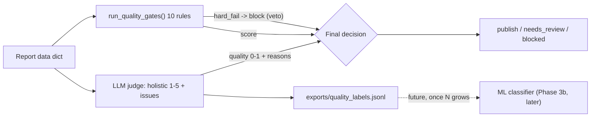

# Quality-Judge — LLM-as-Judge Quality Layer

**Status: Phase 3 kickoff shipped (12 Aug 2026), on `feature/quality-gate-ml`.**

## Why this exists

`quality_gate_service.py`'s 10 rule gates are regex/pattern checks: citation
coverage, arithmetic reconciliation, duplicate detection, staleness,
placeholder scan, etc. They catch failure shapes someone already wrote a
pattern for. They **cannot** catch:

- citations that exist but are weak or barely relevant
- content that's fresh but off-topic
- numbers that are correct but framed misleadingly
- vague, hedge-everything language
- subtle, unsupported bias

That's the gap an LLM-as-judge closes: a holistic read of "does this read like
a professional analyst wrote it, is it well-cited, non-misleading" — the
"taste" regex can't have.

**Why not a supervised ML classifier first (the original Phase 3 plan)?**
Because there were ~0 real quality labels anywhere in this system when this
phase started (39 DB reports, one on-disk JSON, no labeled pass/fail set,
`scikit-learn`/`joblib` absent). Training a classifier today would just
distill the existing rules — the honest sequencing is: **judge now → labels
accumulate → classifier once N is sufficient → human-in-the-loop for
high-stakes calls.**

## Architecture



- **Rules are the floor.** A `hard_fail` from any gate (today: Citation
  Coverage <90%) blocks publication unconditionally. An LLM can never override
  a compliance rule — this is the non-negotiable design constraint.
- **The judge is the ceiling.** It adds a holistic quality signal the rules
  structurally cannot produce.
- **Every judgment is a label.** Logged to `exports/quality_labels.jsonl`,
  which is exactly what makes a real classifier trainable in the future — this
  phase creates the training data that made a classifier impossible today.

## Package layout (`apps/api/app/services/quality/`)

| File | Responsibility |
|---|---|
| `report_text.py` | `flatten_report(data) -> str` — pure, deterministic digest of the report dict (handles both the deep-research shape `financial_intelligence`/... and the lighter DB `sections`/`claims` shape). Truncates to a char budget on a line boundary. |
| `judge.py` | `judge_report(data) -> JudgeVerdict` — the LLM-as-judge core. Pre-screens through `rag/guardrails.check_output`, prompts the LLM for strict JSON, normalizes 1-5 scores to 0-1, self-consistency averaging over `RAG_JUDGE_SAMPLES`. **Fail-soft**: no API key or any error → `ok=False`, never raises. |
| `decision.py` | `evaluate(data, mode) -> dict` — combines rules + judge into one decision. Modes: `rules` \| `judge` \| `blend`. |
| `labels.py` | `log_judgment(...)` — appends one row per judged report to `exports/quality_labels.jsonl`. `build_label_row(...)` is the pure, testable core. |

Plus:
- `app/scripts/quality_judge_demo.py` — before/after CLI demo (rules vs judge vs blend on 3 sample reports).
- `app/scripts/backfill_quality_labels.py` — replays existing DB + on-disk reports through `decision.evaluate(mode="blend")` to seed the label file before any judge has run live.
- `tests/test_quality_judge.py` — 21 tests, LLM calls mocked, no network dependency.

## Modes

Wired into `GET /report-job/{job_id}/quality-gates?mode=rules|judge|blend` (default `rules`, so existing behavior is unchanged unless a caller opts in).

- **`rules`** (default): the original 10-gate battery, unchanged.
- **`judge`**: LLM-as-judge only. Returns `{score 0-1, publishable, dimensions, issues, reasoning}`. If unavailable (no key), decision is `needs_review` (no rules ran, nothing to block on).
- **`blend`**: rules run first. Any `hard_fail` → `blocked` immediately (rules veto, non-negotiable). Otherwise: `combined_score = 0.4 * rule_score + 0.6 * judge_score` (weights via env), mapped to `publication_ready` / `needs_review` / `blocked` against configurable floors. If the judge is unavailable, `blend` degrades transparently to pure rules — the fail-soft contract propagates all the way to the endpoint.

## Judge verdict shape

```json
{
  "quality_score": 4,
  "publishable": true,
  "dimensions": {"accuracy": 4, "citations": 5, "clarity": 3, "relevance": 4, "neutrality": 5},
  "issues": ["citations for segment revenue are thin", "..."],
  "reasoning": "short justification"
}
```

`dimensions` map directly to the gaps rules can't see: weak-but-present
citations (`citations`), fresh-but-irrelevant (`relevance`), correct-but-
misleading (`accuracy`), vague language (`clarity`), subtle bias
(`neutrality`).

## Env vars

| Var | Default | Purpose |
|---|---|---|
| `RAG_JUDGE_MODEL` | `gpt-4o-mini` | Same model config already used by `rag/eval.py::llm_judge_faithfulness` — one shared knob. |
| `RAG_JUDGE_SAMPLES` | `1` | Self-consistency — average N calls for stability. Keep 1 for cost; raise for high-stakes reports. |
| `RAG_JUDGE_TIMEOUT` | `30` | Per-call timeout (seconds). |
| `QUALITY_LABEL_LOG` | `on` | Set `off` to disable label logging (e.g. in load tests). |
| `QUALITY_BLEND_RULE_WEIGHT` | `0.4` | Rule-score weight in `blend` mode (judge gets the remainder). |
| `QUALITY_PUBLISH_FLOOR` | `0.7` | Combined score ≥ floor → `publication_ready`. |
| `QUALITY_REVIEW_FLOOR` | `0.5` | Combined score ≥ floor (below publish floor) → `needs_review`; below → `blocked`. |

## Cost

One LLM call per report (temperature 0, ~500 output tokens), same
`gpt-4o-mini`-class model already used elsewhere in this codebase. No new
heavy dependencies — reuses `requests` + the existing `openai_client`
plumbing pattern from `rag/eval.py`.

## Honest framing

The judge is real holistic quality assessment, not another regex — it
directly closes the "reads wrong but passes the rules" gap. Its judgments are
only as good as the prompt until human review calibrates it, which is exactly
why every verdict is logged: today's judge becomes tomorrow's training set.
Rules retain hard-veto so an LLM can never override a compliance block.

## Deferred: the supervised ML classifier (Phase 3b)

Not built in this phase, by design. Once `exports/quality_labels.jsonl` has
accumulated enough real judgments — the industry rule of thumb is 200-500
examples for a binary classifier — the next step is:

1. Train `LogisticRegression` / `GradientBoostingClassifier` on
   `rule_features` + `judge_score`/`judge_dimensions` as features, human
   review labels (once available) as ground truth.
2. Add `?mode=ml` to the same endpoint, same `decision.py` dispatch pattern.
3. Persist as `quality_model.pkl` via `joblib`.
4. Run in parallel with `judge`/`blend` for a comparison period before any
   cutover; rules retain veto power always.

This is tracked as Phase 3b in `docs/AI-Model-Training-Roadmap.md` — not
started, intentionally gated on label volume from this phase.
