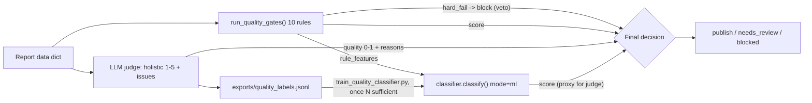

# Quality-Judge — LLM-as-Judge Quality Layer

**Status: Phase 3 kickoff shipped (12 Aug 2026); Phase 3b classifier shipped same day, retrained on 303 samples (23 real + 280 synthetic) on `feature/quality-gate-ml`.**

## Why this exists

`quality_gate_service.py`'s 10 rule gates are regex/pattern checks: citation
coverage, arithmetic reconciliation, duplicate detection, staleness,
placeholder scan, etc. They catch failure shapes someone already wrote a
pattern for. They **cannot** catch:

- citations that exist but are weak or barely relevant
- content that's fresh but off-topic
- numbers that are correct but framed misleadingly
- vague, hedge-everything language
- subtle, unsupported bias

That's the gap an LLM-as-judge closes: a holistic read of "does this read like
a professional analyst wrote it, is it well-cited, non-misleading" — the
"taste" regex can't have.

**Why not a supervised ML classifier first (the original Phase 3 plan)?**
Because there were ~0 real quality labels anywhere in this system when this
phase started (39 DB reports, one on-disk JSON, no labeled pass/fail set,
`scikit-learn`/`joblib` absent). Training a classifier today would just
distill the existing rules — the honest sequencing is: **judge now → labels
accumulate → classifier once N is sufficient → human-in-the-loop for
high-stakes calls.**

## Architecture



- **Rules are the floor.** A `hard_fail` from any gate (today: Citation
  Coverage <90%) blocks publication unconditionally. An LLM can never override
  a compliance rule — this is the non-negotiable design constraint.
- **The judge is the ceiling.** It adds a holistic quality signal the rules
  structurally cannot produce.
- **Every judgment is a label.** Logged to `exports/quality_labels.jsonl`,
  which is exactly what makes a real classifier trainable in the future — this
  phase creates the training data that made a classifier impossible today.

## Package layout (`apps/api/app/services/quality/`)

| File | Responsibility |
|---|---|
| `report_text.py` | `flatten_report(data) -> str` — pure, deterministic digest of the report dict (handles both the deep-research shape `financial_intelligence`/... and the lighter DB `sections`/`claims` shape). Truncates to a char budget on a line boundary. |
| `judge.py` | `judge_report(data) -> JudgeVerdict` — the LLM-as-judge core. Pre-screens through `rag/guardrails.check_output`, prompts the LLM for strict JSON, normalizes 1-5 scores to 0-1, self-consistency averaging over `RAG_JUDGE_SAMPLES`. **Fail-soft**: no API key or any error → `ok=False`, never raises. |
| `decision.py` | `evaluate(data, mode) -> dict` — combines rules + judge (+ classifier) into one decision. Modes: `rules` \| `judge` \| `blend` \| `ml`. |
| `labels.py` | `log_judgment(...)` — appends one row per judged report to `exports/quality_labels.jsonl`. `build_label_row(...)` is the pure, testable core. `rule_features_dict(...)` is the public, shared vectorization also used by `classifier.py` (kept in one place so the two never drift). |
| `classifier.py` | `classify(rule_features) -> ClassifierVerdict`, `get_classifier()` (cached singleton, thread-safe), `QualityClassifier.save/load` (joblib). **Fail-soft**: no trained model on disk → `ok=False`, never raises. |
| `synthetic.py` | `generate_fragment_bank()` (batched Claude calls for prose variety, entity-agnostic by design), `generate_synthetic_reports(n, bank)` (deterministic, no network — assembles report_data dicts from the bank + structural mutation profiles correlated by quality tier), `build_synthetic_report(...)`. See "Synthetic training data" below. |

Plus:
- `app/scripts/quality_judge_demo.py` — before/after CLI demo (rules vs judge vs blend on 3 sample reports).
- `app/scripts/backfill_quality_labels.py` — replays existing DB + on-disk reports through `decision.evaluate(mode="blend")` to seed the label file before any judge has run live. Loads `.env` explicitly up front (a real bug — see "Bugs found seeding real labels" below).
- `app/scripts/train_quality_classifier.py` — trains the Phase 3b classifier from one or more `quality_labels*.jsonl` files (`--labels a.jsonl b.jsonl ...`, defaults to real + synthetic). Refuses to train below `--min-samples` (default 200) unless `--force`; also refuses if synthetic rows exceed `--max-synthetic-fraction` (default 0.85) unless overridden. Always prints and persists the real/synthetic composition in the saved model's `metrics`.
- `app/scripts/generate_synthetic_labels.py` — generates N synthetic reports, runs each through the real rule gates + real judge (parallelized), logs to `exports/quality_labels_synthetic.jsonl` with `source="synthetic"`. Caches the Claude-generated fragment bank to `exports/synthetic_fragment_bank.json` so repeated runs don't re-pay the ~5-8min sequential-call cost.
- `tests/test_quality_judge.py`, `tests/test_quality_classifier.py`, `tests/test_train_quality_classifier.py`, `tests/test_synthetic.py` — 27 + 10 + 9 + 8 = 54 tests, LLM calls mocked (or, for `synthetic.py`, no network path exercised at all), no network dependency.

## Modes

Wired into `GET /report-job/{job_id}/quality-gates?mode=rules|judge|blend|ml` (default `rules`, so existing behavior is unchanged unless a caller opts in).

- **`rules`** (default): the original 10-gate battery, unchanged.
- **`judge`**: LLM-as-judge only. Returns `{score 0-1, publishable, dimensions, issues, reasoning}`. If unavailable (no key), decision is `needs_review` (no rules ran, nothing to block on).
- **`blend`**: rules run first. Any `hard_fail` → `blocked` immediately (rules veto, non-negotiable). Otherwise: `combined_score = 0.4 * rule_score + 0.6 * judge_score` (weights via env), mapped to `publication_ready` / `needs_review` / `blocked` against configurable floors. If the judge is unavailable, `blend` degrades transparently to pure rules — the fail-soft contract propagates all the way to the endpoint.
- **`ml`**: rules run first (same veto). Otherwise the trained classifier scores `rule_features` directly — no LLM call, no network, sub-millisecond. If no model has been trained yet (`app/models/quality_classifier.joblib` missing), degrades transparently to pure rules, identical fail-soft pattern to `blend`.

## Judge verdict shape

```json
{
  "quality_score": 4,
  "publishable": true,
  "dimensions": {"accuracy": 4, "citations": 5, "clarity": 3, "relevance": 4, "neutrality": 5},
  "issues": ["citations for segment revenue are thin", "..."],
  "reasoning": "short justification"
}
```

`dimensions` map directly to the gaps rules can't see: weak-but-present
citations (`citations`), fresh-but-irrelevant (`relevance`), correct-but-
misleading (`accuracy`), vague language (`clarity`), subtle bias
(`neutrality`).

## Env vars

| Var | Default | Purpose |
|---|---|---|
| `RAG_JUDGE_MODEL` | `gpt-4o-mini` | Same model config already used by `rag/eval.py::llm_judge_faithfulness` — one shared knob. |
| `RAG_JUDGE_SAMPLES` | `1` | Self-consistency — average N calls for stability. Keep 1 for cost; raise for high-stakes reports. |
| `RAG_JUDGE_TIMEOUT` | `30` | Per-call timeout (seconds). |
| `QUALITY_LABEL_LOG` | `on` | Set `off` to disable label logging (e.g. in load tests). |
| `QUALITY_BLEND_RULE_WEIGHT` | `0.4` | Rule-score weight in `blend` mode (judge gets the remainder). |
| `QUALITY_PUBLISH_FLOOR` | `0.7` | Combined score ≥ floor → `publication_ready`. |
| `QUALITY_REVIEW_FLOOR` | `0.5` | Combined score ≥ floor (below publish floor) → `needs_review`; below → `blocked`. |

## Cost

One LLM call per report (temperature 0, ~500 output tokens), same
`gpt-4o-mini`-class model already used elsewhere in this codebase. No new
heavy dependencies — reuses `requests` + the existing `openai_client`
plumbing pattern from `rag/eval.py`.

## Honest framing

The judge is real holistic quality assessment, not another regex — it
directly closes the "reads wrong but passes the rules" gap. Its judgments are
only as good as the prompt until human review calibrates it, which is exactly
why every verdict is logged: today's judge becomes tomorrow's training set.
Rules retain hard-veto so an LLM can never override a compliance block.

## The supervised ML classifier (Phase 3b) — shipped, trained on 303 samples

1. `LogisticRegression(class_weight="balanced")` trained on `rule_features`
   (the same 12-key vector `labels.py` already logs: 10 gate scores +
   `overall_score` + `hard_failure_count`) → `judge_publishable` as the
   target. Using the judge's own verdict as ground truth is a deliberate,
   documented proxy (distilling the judge, not human review) — swapping to
   real human-reviewed labels later is a one-line change in the training
   script, not a rewrite.
2. `?mode=ml` on the same endpoint, same `decision.py` dispatch pattern as
   `blend` — rules retain veto power always, degrades to pure rules if no
   model is trained.
3. Persisted as `app/models/quality_classifier.joblib` via `joblib`
   (gitignored — it's a locally-reproducible dev artifact, not a checked-in
   production model).
4. The training script **refuses to train below `--min-samples` (default
   200)** unless `--force` is passed, and tags any forced sub-floor model
   `-demo` in its version string. It also **refuses if synthetic rows exceed
   `--max-synthetic-fraction` (default 0.85)** unless overridden — a second,
   independent guardrail against a model that's purely LLM-imitating-itself.

### Synthetic training data — why, and the honest composition

Real report volume in this system is tiny: 23 usable real labels (22 DB
reports of one product line + 1 on-disk report) after
`backfill_quality_labels.py`. That's nowhere near the 200-sample floor, and
even if it were, all 22 DB reports share the same connector/shape, so their
`rule_features` barely vary — not enough signal diversity for a classifier to
learn anything beyond "always predict the majority class."

`app/services/quality/synthetic.py` + `app/scripts/generate_synthetic_labels.py`
close that gap **without faking the label**:

1. **Claude authors prose variety, never a label.** `generate_fragment_bank()`
   asks `claude-sonnet-4-6` (via `anthropic_client`, same model already used
   for other generation in this codebase) for batches of paragraphs across 6
   quality tiers (excellent / thin-citation / vague-hedging / overconfident /
   biased / misleading) x 6 report sections — ~30 batched calls, not
   hundreds of individual round-trips. Fragments are **entity-agnostic**
   ("the company", never a specific name, no invented dollar figures) so
   they can be safely mixed into any assembled report without contradicting
   its numbers.
2. **Deterministic structural mutation controls what the rule gates see.**
   `MutationProfile` (citation rate, duplicate paragraphs, news staleness,
   placeholder count, arithmetic mismatch, named-person source count,
   sensitive-claim citation) is drawn per-report from a `random.Random(seed)`
   — same seed, same reports, always. Mutation profiles are correlated with
   a `tier` ("high" / "low" / "mixed", weighted 40/40/20) so structural
   cleanliness and prose quality co-vary, giving `judge_publishable` an
   actual learnable relationship with `rule_features` instead of pure noise.
3. **The label itself always comes from the real pipeline.** Every assembled
   report is run through the real `run_quality_gates()` and the real
   `judge_report()` (`decision.evaluate(mode="blend")`) — exactly the same
   code path a live report would hit. Claude never sees or influences the
   score; it only supplies the words.
4. **Labels are logged separately and always visibly tagged.** Synthetic
   rows go to `exports/quality_labels_synthetic.jsonl` with
   `"source": "synthetic"` (vs `"live"` / `"backfill"` for real traffic) —
   see `labels.py`. `train_quality_classifier.py` merges files, reports the
   `{source: count}` composition on every run, and persists it in the saved
   model's `metrics["composition"]` so nobody can look at a model version
   later and be misled about how much of its training data was
   LLM-generated.

**What actually ran (12 Aug 2026):** 280 synthetic reports generated and
judged (`generate_synthetic_labels.py --n 280`), 280/280 judged successfully,
0 failures. Class distribution: 18/280 (6.4%) `judge_publishable=True` — the
real judge is strict even against "high-tier" synthetic prose, most commonly
flagging weak citation strength and thin sensitive-claim sourcing regardless
of narrative quality. This is an honest reflection of judge strictness, not
an artifact worth "fixing" by loosening the judge or gaming the generator.

Combined with the 23 real (well, 24 by the time this ran — one extra label
accumulated) labels, `train_quality_classifier.py --max-synthetic-fraction
0.95` trained **`v1-n303`** — 303 usable rows, 92.4% synthetic (composition
printed and stored, per point 4 above), `accuracy=0.689`, `f1=0.387` on a
held-out 20% split. `v1-n303` has no `-demo` suffix: it cleared the
documented 200-sample floor for real, not via `--force`. The `f1=0.387` is
modest — expected at a still-small N with an 18-vs-262 class imbalance — and
the honest next step is accumulating more real labels over time (organic
live/backfill traffic) to gradually reduce the synthetic fraction and
improve `f1`, not to inflate synthetic volume further to compensate.

Check `ml_result.model_version` on any `?mode=ml` response to know exactly
which model version scored a given report, and cross-reference this doc for
what that version was trained on.

## Bugs found while seeding real labels (12 Aug 2026)

Running `backfill_quality_labels.py` against **real production data** (not
just the synthetic test fixtures) surfaced two real bugs the mocked test
suite couldn't catch, because it never exercised the actual shape of real
report JSON:

1. **Missing `.env` load in the backfill script.** `judge_report()` checks
   `os.getenv("OPENAI_API_KEY")` directly; the script relied on an import
   side-effect (some other module's `load_dotenv()` call) to populate the
   env, which only happened to fire *after* the disk-sourced report had
   already been processed. Every judge call against the on-disk report
   silently failed with "OPENAI_API_KEY not configured" while DB reports
   (processed later) worked fine. Fixed by calling `load_dotenv(find_dotenv())`
   explicitly at the top of the script, not relying on import ordering.
2. **`ArithmeticReconciliationGate` crashed on dict-shaped `segments`.**
   Identical bug class to the `flatten_report()` fix from the previous
   session: `financial_intelligence.segments` in real reports is
   `{"segments": [...], "geographic": [...]}` (a dict of category ->
   rows), not a flat list. `for s in segments` iterated the dict's string
   keys, and `s.get("revenue")` then raised. Every real report's rule-gate
   evaluation silently caught this per-gate exception (logged a warning,
   scored the gate 0.0) and reported `hard_failures` that included gates
   which should have passed. Fixed with the same `_as_list()` normalizer
   pattern, now shared by both `report_text.py` and `quality_gate_service.py`.
   Regression test: `test_arithmetic_reconciliation_handles_dict_shaped_segments_and_contracts`
   in `tests/test_quality_judge.py`.

Both fixes are covered by regression tests and verified against the actual
on-disk NVIDIA report end-to-end (23/23 reports judged successfully after the
fix, versus 22/23 with the arithmetic gate silently erroring before it).
