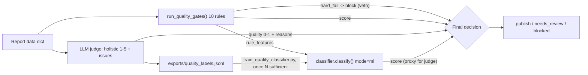

# Quality-Judge — LLM-as-Judge Quality Layer

**Status: Phase 3 kickoff shipped (12 Aug 2026); Phase 3b classifier scaffold shipped same day, on `feature/quality-gate-ml`.**

## Why this exists

`quality_gate_service.py`'s 10 rule gates are regex/pattern checks: citation
coverage, arithmetic reconciliation, duplicate detection, staleness,
placeholder scan, etc. They catch failure shapes someone already wrote a
pattern for. They **cannot** catch:

- citations that exist but are weak or barely relevant
- content that's fresh but off-topic
- numbers that are correct but framed misleadingly
- vague, hedge-everything language
- subtle, unsupported bias

That's the gap an LLM-as-judge closes: a holistic read of "does this read like
a professional analyst wrote it, is it well-cited, non-misleading" — the
"taste" regex can't have.

**Why not a supervised ML classifier first (the original Phase 3 plan)?**
Because there were ~0 real quality labels anywhere in this system when this
phase started (39 DB reports, one on-disk JSON, no labeled pass/fail set,
`scikit-learn`/`joblib` absent). Training a classifier today would just
distill the existing rules — the honest sequencing is: **judge now → labels
accumulate → classifier once N is sufficient → human-in-the-loop for
high-stakes calls.**

## Architecture



- **Rules are the floor.** A `hard_fail` from any gate (today: Citation
  Coverage <90%) blocks publication unconditionally. An LLM can never override
  a compliance rule — this is the non-negotiable design constraint.
- **The judge is the ceiling.** It adds a holistic quality signal the rules
  structurally cannot produce.
- **Every judgment is a label.** Logged to `exports/quality_labels.jsonl`,
  which is exactly what makes a real classifier trainable in the future — this
  phase creates the training data that made a classifier impossible today.

## Package layout (`apps/api/app/services/quality/`)

| File | Responsibility |
|---|---|
| `report_text.py` | `flatten_report(data) -> str` — pure, deterministic digest of the report dict (handles both the deep-research shape `financial_intelligence`/... and the lighter DB `sections`/`claims` shape). Truncates to a char budget on a line boundary. |
| `judge.py` | `judge_report(data) -> JudgeVerdict` — the LLM-as-judge core. Pre-screens through `rag/guardrails.check_output`, prompts the LLM for strict JSON, normalizes 1-5 scores to 0-1, self-consistency averaging over `RAG_JUDGE_SAMPLES`. **Fail-soft**: no API key or any error → `ok=False`, never raises. |
| `decision.py` | `evaluate(data, mode) -> dict` — combines rules + judge (+ classifier) into one decision. Modes: `rules` \| `judge` \| `blend` \| `ml`. |
| `labels.py` | `log_judgment(...)` — appends one row per judged report to `exports/quality_labels.jsonl`. `build_label_row(...)` is the pure, testable core. `rule_features_dict(...)` is the public, shared vectorization also used by `classifier.py` (kept in one place so the two never drift). |
| `classifier.py` | `classify(rule_features) -> ClassifierVerdict`, `get_classifier()` (cached singleton, thread-safe), `QualityClassifier.save/load` (joblib). **Fail-soft**: no trained model on disk → `ok=False`, never raises. |

Plus:
- `app/scripts/quality_judge_demo.py` — before/after CLI demo (rules vs judge vs blend on 3 sample reports).
- `app/scripts/backfill_quality_labels.py` — replays existing DB + on-disk reports through `decision.evaluate(mode="blend")` to seed the label file before any judge has run live. Loads `.env` explicitly up front (a real bug — see "Bugs found seeding real labels" below).
- `app/scripts/train_quality_classifier.py` — trains the Phase 3b classifier from `exports/quality_labels.jsonl`. Refuses to train below `--min-samples` (default 200) unless `--force` is passed; a forced sub-floor model is tagged `-demo` in its version string so it can never be mistaken for production-grade.
- `tests/test_quality_judge.py`, `tests/test_quality_classifier.py`, `tests/test_train_quality_classifier.py` — 23 + 10 + 5 = 38 tests, LLM calls mocked, no network dependency.

## Modes

Wired into `GET /report-job/{job_id}/quality-gates?mode=rules|judge|blend|ml` (default `rules`, so existing behavior is unchanged unless a caller opts in).

- **`rules`** (default): the original 10-gate battery, unchanged.
- **`judge`**: LLM-as-judge only. Returns `{score 0-1, publishable, dimensions, issues, reasoning}`. If unavailable (no key), decision is `needs_review` (no rules ran, nothing to block on).
- **`blend`**: rules run first. Any `hard_fail` → `blocked` immediately (rules veto, non-negotiable). Otherwise: `combined_score = 0.4 * rule_score + 0.6 * judge_score` (weights via env), mapped to `publication_ready` / `needs_review` / `blocked` against configurable floors. If the judge is unavailable, `blend` degrades transparently to pure rules — the fail-soft contract propagates all the way to the endpoint.
- **`ml`**: rules run first (same veto). Otherwise the trained classifier scores `rule_features` directly — no LLM call, no network, sub-millisecond. If no model has been trained yet (`app/models/quality_classifier.joblib` missing), degrades transparently to pure rules, identical fail-soft pattern to `blend`.

## Judge verdict shape

```json
{
  "quality_score": 4,
  "publishable": true,
  "dimensions": {"accuracy": 4, "citations": 5, "clarity": 3, "relevance": 4, "neutrality": 5},
  "issues": ["citations for segment revenue are thin", "..."],
  "reasoning": "short justification"
}
```

`dimensions` map directly to the gaps rules can't see: weak-but-present
citations (`citations`), fresh-but-irrelevant (`relevance`), correct-but-
misleading (`accuracy`), vague language (`clarity`), subtle bias
(`neutrality`).

## Env vars

| Var | Default | Purpose |
|---|---|---|
| `RAG_JUDGE_MODEL` | `gpt-4o-mini` | Same model config already used by `rag/eval.py::llm_judge_faithfulness` — one shared knob. |
| `RAG_JUDGE_SAMPLES` | `1` | Self-consistency — average N calls for stability. Keep 1 for cost; raise for high-stakes reports. |
| `RAG_JUDGE_TIMEOUT` | `30` | Per-call timeout (seconds). |
| `QUALITY_LABEL_LOG` | `on` | Set `off` to disable label logging (e.g. in load tests). |
| `QUALITY_BLEND_RULE_WEIGHT` | `0.4` | Rule-score weight in `blend` mode (judge gets the remainder). |
| `QUALITY_PUBLISH_FLOOR` | `0.7` | Combined score ≥ floor → `publication_ready`. |
| `QUALITY_REVIEW_FLOOR` | `0.5` | Combined score ≥ floor (below publish floor) → `needs_review`; below → `blocked`. |

## Cost

One LLM call per report (temperature 0, ~500 output tokens), same
`gpt-4o-mini`-class model already used elsewhere in this codebase. No new
heavy dependencies — reuses `requests` + the existing `openai_client`
plumbing pattern from `rag/eval.py`.

## Honest framing

The judge is real holistic quality assessment, not another regex — it
directly closes the "reads wrong but passes the rules" gap. Its judgments are
only as good as the prompt until human review calibrates it, which is exactly
why every verdict is logged: today's judge becomes tomorrow's training set.
Rules retain hard-veto so an LLM can never override a compliance block.

## Deferred: the supervised ML classifier (Phase 3b) — scaffold shipped, model still demo-grade

The pipeline is built and wired end-to-end (`app/services/quality/classifier.py`,
`app/scripts/train_quality_classifier.py`, `?mode=ml`), but the **model itself
is not production-grade** — real label volume is nowhere near the 200-500
floor yet:

1. `LogisticRegression(class_weight="balanced")` trained on `rule_features`
   (the same 12-key vector `labels.py` already logs: 10 gate scores +
   `overall_score` + `hard_failure_count`) → `judge_publishable` as the
   target. Using the judge's own verdict as ground truth is a deliberate,
   documented proxy (distilling the judge, not human review) — swapping to
   real human-reviewed labels later is a one-line change in the training
   script, not a rewrite.
2. `?mode=ml` on the same endpoint, same `decision.py` dispatch pattern as
   `blend` — rules retain veto power always, degrades to pure rules if no
   model is trained.
3. Persisted as `app/models/quality_classifier.joblib` via `joblib`
   (gitignored — it's a locally-reproducible dev artifact, not a checked-in
   production model).
4. The training script **refuses to train below `--min-samples` (default
   200)** unless `--force` is passed, and tags any forced sub-floor model
   `-demo` in its version string. This is the safeguard against exactly the
   failure mode this doc originally warned about — a classifier that just
   memorizes 20 examples of noise.

**Current real label count: 23** (seeded via `backfill_quality_labels.py`
against the 22 real DB reports + the on-disk NVIDIA report, with real
`gpt-4o-mini` judge calls). A `v1-n23-demo` model was trained with `--force`
purely to validate the pipeline end-to-end (`accuracy=0.60`, `f1=0.75` on a
held-out split of 5 samples — not a real generalization signal at this N).
Run `train_quality_classifier.py` again without `--force` once labels clear
200 for a model actually worth trusting; the demo model's `-demo` version tag
makes it easy to check `ml_result.model_version` and know a report is being
scored by a non-production model.

## Bugs found while seeding real labels (12 Aug 2026)

Running `backfill_quality_labels.py` against **real production data** (not
just the synthetic test fixtures) surfaced two real bugs the mocked test
suite couldn't catch, because it never exercised the actual shape of real
report JSON:

1. **Missing `.env` load in the backfill script.** `judge_report()` checks
   `os.getenv("OPENAI_API_KEY")` directly; the script relied on an import
   side-effect (some other module's `load_dotenv()` call) to populate the
   env, which only happened to fire *after* the disk-sourced report had
   already been processed. Every judge call against the on-disk report
   silently failed with "OPENAI_API_KEY not configured" while DB reports
   (processed later) worked fine. Fixed by calling `load_dotenv(find_dotenv())`
   explicitly at the top of the script, not relying on import ordering.
2. **`ArithmeticReconciliationGate` crashed on dict-shaped `segments`.**
   Identical bug class to the `flatten_report()` fix from the previous
   session: `financial_intelligence.segments` in real reports is
   `{"segments": [...], "geographic": [...]}` (a dict of category ->
   rows), not a flat list. `for s in segments` iterated the dict's string
   keys, and `s.get("revenue")` then raised. Every real report's rule-gate
   evaluation silently caught this per-gate exception (logged a warning,
   scored the gate 0.0) and reported `hard_failures` that included gates
   which should have passed. Fixed with the same `_as_list()` normalizer
   pattern, now shared by both `report_text.py` and `quality_gate_service.py`.
   Regression test: `test_arithmetic_reconciliation_handles_dict_shaped_segments_and_contracts`
   in `tests/test_quality_judge.py`.

Both fixes are covered by regression tests and verified against the actual
on-disk NVIDIA report end-to-end (23/23 reports judged successfully after the
fix, versus 22/23 with the arithmetic gate silently erroring before it).
