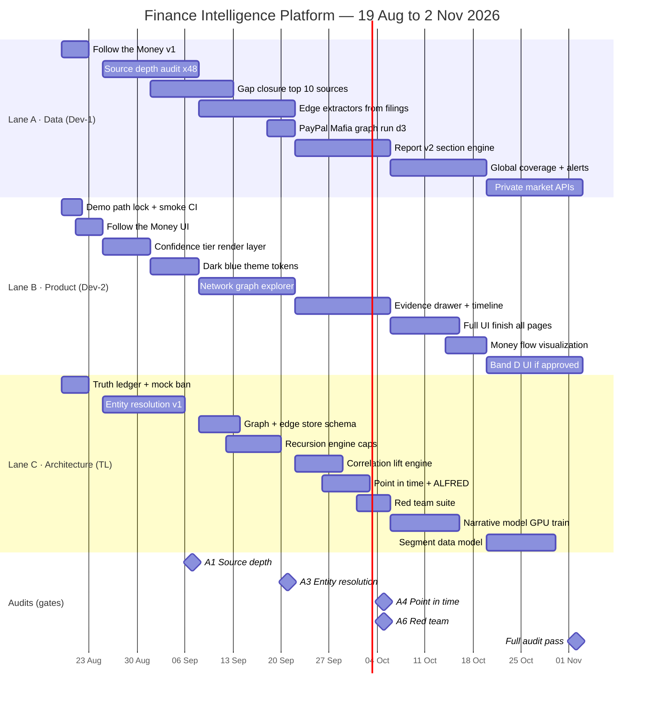

# Program Plan — Finance Intelligence Platform

**Owner:** Anshuman (Tech Lead) · **Team:** TL + 2 developers · **Date:** 19 Aug 2026
**Horizon:** 19 Aug → 2 Nov 2026 (6 sprints) · **Source of truth for execution**

Companion docs: [CEO one-pager](01-CEO-ONE-PAGER.md) · [CEO operating manual](03-CEO-OPERATING-MANUAL.md) · [Audit playbook](04-VERIFICATION-AUDIT-PLAYBOOK.md) · [Source depth register](05-SOURCE-DEPTH-REGISTER.md) · [Decision log](06-DECISION-LOG.md)

---

## 1. The diagnosis (read this first)

Two facts sit next to each other and cannot both be comfortable:

| Claim | Evidence |
|---|---|
| "78 of 72 features done (~108%)" | `MASTER_TASK_STATUS.md`, 19 Aug |
| 40 of 89 services contain mock / synthetic / placeholder code paths | `rg "mock\|placeholder\|random.uniform\|TODO" apps/api/app/services` |
| "Nothing on link is working at all. I didn't look great." | James, 05 Aug |
| "Fred api and all of the ones we have integrated you are using. There is a lot of data there. **You really need to research each source.**" | James, 18 Aug |

**Conclusion: we are feature-rich and evidence-poor.**

We have built 75 pages, 75 routers, 44 connectors and 89 services. What we have *not* built is
the thing that makes any of it defensible: a resolved entity graph, real extraction depth per
source, and a provenance chain from every rendered number back to a document.

> The 108% number is a liability, not an asset. The moment James clicks a "done" feature and sees
> a synthetic number, every metric I have ever reported to him becomes suspect. **Sprint 0 retires
> the feature-count metric.**

### 1.1 What James is actually asking for, in one sentence

> A recursive, evidence-backed intelligence graph over money, people and entities — that renders
> as a picture he can show someone else.

Every message in `JAMES_ASKS.txt` reduces to five verbs. Four are his. The fifth is mine to insert.

```
   ┌──────────┐   ┌──────────┐   ┌────────────┐   ┌─────────┐   ┌────────┐
   │  FOLLOW  │──▶│  DEEPEN  │──▶│ CORRELATE  │──▶│  PROVE  │──▶│  SHOW  │
   └──────────┘   └──────────┘   └────────────┘   └─────────┘   └────────┘
    money,         recurse         find non-        evidence,      picture
    people,        into every      obvious          confidence,    he can
    entities       entity found    linkage          point-in-time  forward

    his words:     his words:      his words:       (he never       his words:
    "follow the    "go further     "that will       says this —     "timeline
     money"         and further     help you find    it is the       would be
                    in always"      correlations"    tech lead's     great,
                                                     job)            tables,
                                                                     graphs"
```

`PROVE` is the load-bearing insert. Without it, `FOLLOW + DEEPEN + CORRELATE` is a conspiracy
generator with a Bloomberg skin, and it is a legal liability the day a real customer reads it.
See [risk R2](06-DECISION-LOG.md#r2).

### 1.2 The one architectural thing that is genuinely missing

Everything else is incremental. This is not:

```
   WE HAVE                              WE DO NOT HAVE
   ─────────────────────────────        ─────────────────────────────────────
   44 connectors                        A canonical Entity (Person / Org)
   correlation_service.py               An edge store with evidence + as_of
   cooccurrence_service.py              Entity resolution (is this Peter
   coinvestment_network_service.py        Thiel the same Peter Thiel?)
   recursive_entity_service.py          A recursion engine with depth +
   founder_correlations_service.py        budget caps
   entity_network_connector.py          Base-rate correction on co-occurrence
   models/evidence.py, api/evidence.py  EvidenceRef enforced at render time
```

Nine components that all *describe* a graph, and no graph. Each service builds its own ad-hoc
adjacency in memory, from its own idea of who "Peter Thiel" is, and throws it away. That is why
depth cannot be increased: there is nothing to recurse *into*.

**Sprint 2 exists solely to build that. It is the highest-leverage two weeks in this plan.**

---

## 2. Workstreams

Eight workstreams, mapped onto the five verbs.

| # | Workstream | Verb | Why it exists | Lane |
|---|---|---|---|---|
| **W1** | **Source Depth** | Follow | James's 18 Aug instruction, verbatim. Breadth → depth. | A |
| **W2** | **Intelligence Graph** | Deepen | The missing architecture (§1.2). | C |
| **W3** | **Follow the Money** | Follow | Officials → trades → lobbying → contracts. His freshest ask. | A |
| **W4** | **Correlation Engine** | Correlate | Lift over base rate, not raw co-occurrence counts. | C |
| **W5** | **Evidence & Verification** | Prove | Every claim: source, date, document, confidence tier. | C |
| **W6** | **Visual Intelligence** | Show | Dark-blue finance UI, network/timeline/bubble views, Report v2. | B |
| **W7** | **Data Expansion** | Follow | Private-market layer. Blocked on [D2](06-DECISION-LOG.md#d2). | A |
| **W8** | **AI & Agents** | Deepen | Narrative model, multi-agent research, Claude-skills triage. | C |

### 2.1 Dependency chain — do not violate this order

```
W1 Source Depth ──┐
                  ├──▶ W2 Graph ──▶ W4 Correlation ──▶ W6 Report v2 / Visual
W5 Evidence   ────┘         │                              ▲
                            └──▶ W3 Follow the Money ──────┘
                                        │
W7 Data Expansion ──────────────────────┘   (parallel, budget-gated)
W8 AI & Agents  ────────────────────────┘   (parallel, GPU-gated)

RULE: nothing in W4 or W6 ships before its W5 evidence contract exists.
      A rendered correlation without an EvidenceRef is a defect, not a feature.
```

W3 and W6 can run in parallel with W2 because they consume the graph through an interface, not
through its internals. W7 and W8 are fully parallel and externally gated (budget, GPU) — they are
where slack capacity goes, never where critical-path capacity goes.

---

## 3. Team, lanes and capacity

Three people. Three lanes. **File-level ownership so two people never touch the same file** —
this pattern already worked in `docs/tasks/Task-Assignment-Detailed.md` and is retained.

| Lane | Who | Owns (files) | Never touches |
|---|---|---|---|
| **A — Data & Sources** | Dev-1 (Rishav) | `apps/api/app/connectors/**`, `packages/connectors/**`, `scripts/**`, ingest-side services | `apps/web/**`, `app/models/**` |
| **B — Product & Visual** | Dev-2 | `apps/web/**`, `apps/admin/**`, `apps/extension/**`, design tokens | `apps/api/app/**` |
| **C — Architecture & Intelligence** | Anshuman (TL) | `app/models/**`, `app/db/**`, `app/core/**`, `services/{graph,evidence,quality,rag}/**`, router wiring in `app/api/**` | connectors, web |

### 3.1 Real capacity — plan against this, not against 3 × 40

| Person | Coding h/week | Non-coding | Rationale |
|---|---|---|---|
| Dev-1 | 35 | 0 | 5 × 7h focused |
| Dev-2 | 35 | 0 | 5 × 7h focused |
| TL (you) | **20** | 15 | Lead duties: CEO comms, review, planning, unblocking, audits |
| **Total** | **90 h/week** | | **180 h per 2-week sprint** |

Two guard-rails that make an aggressive plan survivable:

- **Never plan above 180h/sprint.** Where an epic list below exceeds it, the cut line is stated
  explicitly. Aggressive means *high parallelism and short feedback loops*, not overbooking.
- **10% (18h) reserved per sprint** for the demo-path guarantee and CEO-forwarded triage. James
  sends unplanned research 2–3× per week; that is a known, budgeted input, not an interruption.

### 3.2 RACI

| Activity | TL | Dev-1 | Dev-2 | James |
|---|---|---|---|---|
| Architecture, data model, graph schema | **A/R** | C | C | I |
| Source depth audits | A | **R** | I | I |
| Connector depth / gap closure | A | **R** | I | I |
| UI, theme, visualization | A | I | **R** | C |
| Evidence & confidence contract | **A/R** | C | C | **C** |
| Verification audits | **A/R** | C | C | I |
| Scope, budget, segment decisions | R | I | I | **A** |
| CEO comms + weekly artifact | **A/R** | C | C | **A** |

Only one row has James as Accountable-and-only-Accountable: **scope, budget, segment**. Every open
item in that row is in the [decision log](06-DECISION-LOG.md), and each is blocking something.

---

## 4. Priority ladder

Priority is assigned by **trust-at-risk**, not by feature attractiveness. Anything that can make
James distrust a number he is shown outranks anything that adds a number.

| Rank | Band | Contents | Test for inclusion |
|:--:|---|---|---|
| **P0** | Trust floor | Demo-path lock · truth ledger · mock ban · Follow-the-Money v1 | If this is wrong, everything else reads as false |
| **P1** | Depth | 48-source depth audit · gap closure on top 10 · entity resolution · confidence tiers · dark-blue theme | James's literal instruction + the missing architecture |
| **P2** | Intelligence | Graph store · recursion engine · edge extractors · PayPal Mafia at depth 3 · network UI | The moat |
| **P3** | Proof & narrative | Correlation lift · Report v2 (25 sections) · point-in-time · red team · evidence drawer | Makes the moat defensible |
| **P4** | Show | Full UI finish · money-flow viz · narrative model · global coverage | Makes the moat sellable |
| **P5** | Expand | Private-market APIs · Band D (if approved) · Band C remainder | Budget/decision-gated |
| **CUT** | Declined | Crypto depth · native app · offline · biometrics · widgets · UGC sharing | See [D6](06-DECISION-LOG.md#d6) |

### 4.1 What the 72-feature register becomes

The register is **not** a task list, and the "108% complete" reading of it is the single most
misleading artifact in the project. Re-scored against real-data verification:

```
BAND A  14 feats  ██████████████░░  claimed 13/14 → VERIFY, do not rebuild   (Sprint 0 ledger)
BAND B  17 feats  ████████████████  claimed 17/17 → 6 rest on synthetic data (Sprint 3 verify)
BAND C  25 feats  ███████████░░░░░  claimed 17/25 → 8 open, L-series verify   (Sprint 3–4)
BAND D  11 feats  ░░░░░░░░░░░░░░░░  BLOCKED on segment decision D1           (do not build)
BAND E   5 feats  ███░░░░░░░░░░░░░  3 built anyway (E2/E3/E5) — sunk, ignore  (CUT)

Re-framing: the remaining work in the register is mostly VERIFICATION, not CONSTRUCTION.
An audit pass is cheaper than a build pass and it is what the CEO is actually asking for.
```

---

## 5. Timeline — 6 sprints, 19 Aug → 2 Nov

Every sprint ends with **one artifact James can look at**, chosen to resemble the references he
sends (WSJ money-flow visual, PayPal-Mafia bubble chart, 70-page intelligence PDF). See
[why that matters](03-CEO-OPERATING-MANUAL.md#4-how-he-validates).

| Sprint | Dates | Days | Theme | CEO artifact at the end |
|:--:|---|:--:|---|---|
| **S0** | Wed 19 Aug → Sun 24 Aug | 4.5 | **Truth & Demo Lock** | Follow-the-Money leaderboards live + Truth Ledger |
| **S1** | Mon 25 Aug → Sun 7 Sep | 10 | **Depth** | 48-source Depth Report + FRED/EDGAR deep-extraction demo |
| **S2** | Mon 8 Sep → Sun 21 Sep | 10 | **Intelligence Graph** | PayPal Mafia interactive graph, depth 3, every edge sourced |
| **S3** | Mon 22 Sep → Sun 5 Oct | 10 | **Correlate & Prove** | NVIDIA Intelligence Report v2, 25 sections, confidence-tiered |
| **S4** | Mon 6 Oct → Sun 19 Oct | 10 | **Show** | Dark-blue finance UI + money-flow visualization |
| **S5** | Mon 20 Oct → Sun 2 Nov | 10 | **Expand** | Private-market data layer + segment decision implemented |



### 5.1 Parallelism map — how three people cover eight workstreams

```
        S0        S1            S2            S3            S4            S5
      Aug19-24  Aug25-Sep7   Sep8-21      Sep22-Oct5    Oct6-19      Oct20-Nov2
      ────────  ───────────  ───────────  ───────────   ───────────  ───────────
DEV-1  W3 FTM    W1 depth     W2 edge      W6 report     W1 coverage  W7 private
 (A)   v1 ship   audit x48    extractors   v2 engine     + alerts     market API
                 W1 gap top10 W2 mafia d3                W3 verify
      ────────  ───────────  ───────────  ───────────   ───────────  ───────────
DEV-2  Demo      W5 conf      W6 network   W6 evidence   W6 UI        W6 Band D
 (B)   lock      tiers UI     graph        drawer +      finish +     UI (gated)
       W3 FTM UI W6 theme     explorer     timeline      money flow
      ────────  ───────────  ───────────  ───────────   ───────────  ───────────
 TL    Truth     W2 entity    W2 graph     W4 lift       W8 narrative W5 segment
 (C)   ledger    resolution   store +      W5 point-in-  GPU train    data model
       Mock ban  v1           recursion    time + red    W8 skills    Full audit
       W1 first6              engine       team          triage
      ────────  ───────────  ───────────  ───────────   ───────────  ───────────
GATE   ▲ no mock ▲ A1 audit   ▲ A3 audit   ▲ A4+A6      ▲ A7 daily   ▲ A1-A8
       in prod     passes       passes       audits        green        full pass
```

Reading the map: at any moment one person is making data deeper, one is making it visible, and one
is making it true. That is the whole staffing thesis — **depth, visibility and truth advance
simultaneously or the product regresses on trust while gaining features**, which is exactly the
state we are in today.

---

## 6. Sprint detail

Legend: **Owner** · **h** estimated hours · `▲` = ships to James · `⛔` = gate, blocks the sprint close

### S0 · Truth & Demo Lock — Wed 19 → Sun 24 Aug (capacity ≈ 80h)

**Sprint goal:** James can click every link and see either a real number or an honest "no data".
Nothing in between. Plus his 18 Aug Excel ask is live.

| ID | Epic / task | Owner | h | Detail |
|---|---|---|:--:|---|
| **S0-A** | **Demo path lock** ⛔ | Dev-2 | 18 | Enumerate all 75 routes in `apps/web/pages`. Script hits every route + its backing endpoint, asserts 200 **and** non-empty payload. Wire as CI gate + 15-min cron against staging. Publish `/status` badge. |
| **S0-B** | **Truth ledger** ⛔ | TL + Dev-1 | 14 | Script scans 89 services + 75 routers for mock markers; classifies every endpoint `REAL / PARTIAL / MOCK`. Emits `docs/program/TRUTH-LEDGER.md` + serves at `GET /health/data`. Regenerated nightly. |
| **S0-C** | **Mock ban contract** ⛔ | TL | 8 | `core/no_data.py` → `no_data(reason)` returns HTTP 503 with typed reason. `<NoDataState/>` in web. Test that fails CI if `random.` or `synthetic` appears in a non-test service path. **No endpoint may ever return a fabricated number.** |
| **S0-D** | **Follow the Money v1** ▲ | Dev-1 | 22 | FTM1–FTM7: parse `US Government Officials — Stock Trading Rankings.xlsx` (637 officials, 7 sheets) → `PoliticianRanking`, `NotableInsiderCase`, `LobbyingFirm` models → `politician_leaderboard_service` → 7 endpoints under `/market/gov-trading/`. |
| **S0-E** | **Follow the Money UI** ▲ | Dev-2 | 12 | Leaderboard tabs (trades / volume / returns / executive), `PoliticianCard`, Notable Cases timeline, "vs S&P 500" badge, `pages/follow-the-money.js`. |
| **S0-F** | Source depth template + first 6 | TL | 10 | Fill [register](05-SOURCE-DEPTH-REGISTER.md) for FRED, SEC EDGAR, SEC-API, Congress, FEC, USASpending. Establishes the format Dev-1 mass-produces in S1. |
| | **Total** | | **84** | Over by 4h. **Cut line: S0-F drops to 3 sources.** |

**Definition of done:** smoke suite green on all 75 routes · truth ledger published · zero
fabricated numbers reachable from the UI · leaderboards live on staging with James's own data.

**Why this is P0 and not "cleanup":** James's 05 Aug reaction was *"nothing on link is working at
all. **I didn't look great.**"* The second sentence is the important one — he is demoing this to
other people. Demo reliability is not polish for him, it is reputational. See
[his anxiety](03-CEO-OPERATING-MANUAL.md#5-the-anxiety-he-has-told-you-about-once).

---

### S1 · Depth — Mon 25 Aug → Sun 7 Sep (capacity ≈ 180h)

**Sprint goal:** answer James's 18 Aug instruction with a document, and stop guessing who a person is.

| ID | Epic / task | Owner | h | Detail |
|---|---|---|:--:|---|
| **S1-A** | **48-source depth audit** ▲⛔ | Dev-1 (60) + TL (20) | 80 | One page per source × 48. Per source: endpoints available vs. used, **fields available vs. extracted**, history depth, latency, rate limit, cost, ToS, quality notes, entity IDs emitted, failure mode, fallback. Output: register + ranked gap list. Audit [A1](04-VERIFICATION-AUDIT-PLAYBOOK.md#a1). |
| **S1-B** | **Gap closure — top 10 sources** | Dev-1 | 40 | The ten with the largest extracted/available ratio gap. Named targets in §6.1 below. |
| **S1-C** | **Entity resolution v1** ⛔ | TL | 30 | Canonical `Entity(kind=person\|org)`. Deterministic keys first: CIK, LEI, ticker, FEC candidate/committee ID, Bioguide ID, CRD. Then scored fuzzy match with alias table + human review queue. Nothing enters the graph unresolved. |
| **S1-D** | **Confidence tier render layer** | Dev-2 | 25 | Four tiers — `CONFIRMED / REPORTED / INFERRED / SPECULATIVE`. `<ConfidenceBadge/>` + source-breakdown tooltip. Enforced at render: a claim with no tier does not render. |
| **S1-E** | Dark-blue finance theme | Dev-2 | 30 | Design tokens + density pass. James: *"dark blue would be more finance… as simple clean as possible."* |
| | **Total** | | **205** | Over by 25h. **Cut line: S1-E ships tokens + top 15 pages only; rest moves to S4.** |

#### 6.1 The ten depth gaps to close in S1-B

These are the specific "there is a lot of data there" cases. Each is a source we call shallowly today.

| Source | What we take now | What is sitting there unused | Why it matters to James |
|---|---|---|---|
| **FRED** | A handful of series | Full category tree, releases, **ALFRED vintages** | Vintages give *point-in-time* macro — no look-ahead. Unlocks audit [A4](04-VERIFICATION-AUDIT-PLAYBOOK.md#a4) for free. |
| **SEC EDGAR** | 10-K/10-Q/8-K, Form 4 | **All exhibits**, full XBRL fact set, SC 13D/G | 13D/G = activist stakes. Nothing in the platform reads them today. |
| **SEC-API.io** | Form D, 13F, insiders | Form D **full investor lists**, 13D/G, S-1 | Form D investor names are the single richest private-money edge source we already pay for. |
| **FEC** | Candidate/committee | **Contributions by employer + occupation** | A free person→company edge, at national scale. Directly serves "follow the money". |
| **Senate LDA** | Firm-level filings | Issue codes, **named lobbyists**, covered officials | Named lobbyists are people-nodes; covered officials are the revolving door. |
| **USASpending** | Prime awards | **Sub-awards**, recipient parent hierarchy | Sub-awards reveal the supply chain under a contract. |
| **OpenSecrets** | Contributions | Revolving-door profiles, personal financials | Officials' own holdings — the other half of PTR data. |
| **Congress.gov** | Member data | Bills → sponsors → committees → votes | Legislation-to-trade timing, which is the whole insider thesis. |
| **CourtListener** | Case records | **Docket entries**, parties, RECAP documents | Docket velocity is the timing edge in the L-series (item 53). |
| **Proxy (DEF 14A)** | Basic parsing | Director bios, **other-board seats**, comp, related-party txns | Related-party transactions section is where family entities are literally disclosed. |

That last row deserves emphasis. James keeps asking about *"wives, kids, other corporate entities,
holding companies"*. Public companies are **required to disclose** related-party transactions in
DEF 14A Item 404. We are parsing proxies for board names and skipping the part that answers his
actual question. Fixing one parser answers a six-week-old recurring request.

---

### S2 · Intelligence Graph — Mon 8 Sep → Sun 21 Sep (capacity ≈ 180h)

**Sprint goal:** the missing architecture from §1.2 exists, and PayPal Mafia runs through it at depth 3.

| ID | Epic / task | Owner | h | Detail |
|---|---|---|:--:|---|
| **S2-A** | **Edge store schema** ⛔ | TL | 25 | `Edge(src_entity, dst_entity, type, as_of, valid_to, evidence_ref, confidence_tier, source_id)`. Postgres + adjacency queries; `networkx` projection for analytics only, never as the store. **An edge without `evidence_ref` cannot be inserted — DB constraint, not convention.** |
| **S2-B** | **Recursion engine** ⛔ | TL (25) + Dev-1 (20) | 45 | Breadth-first expansion with hard caps: `max_depth=3`, `max_entities/run`, `max_$/run` via existing `cost_controls.py`. Frontier prioritised by edge confidence × novelty. Resumable, idempotent, cached. **Caps are the answer to "go further and further in always" — see [R3](06-DECISION-LOG.md#r3).** |
| **S2-C** | **Edge extractors** | Dev-1 | 45 | Turn filings into typed edges: Form 4 → `person–officer_of–org`; SC 13D/G → `holder–activist_stake–org`; Form D → `investor–funded–org`; FEC → `person–employed_by–org`; LDA → `firm–lobbied_for–org`; DEF 14A → `person–director_of–org` + `person–related_party–entity`; USASpending → `agency–awarded–vendor`; PTR → `official–traded–security`. |
| **S2-D** | **PayPal Mafia at depth 3** ▲ | Dev-1 | 15 | Seed the 23 named members from `JAMES_ASKS.txt`. Expand to depth 3. Target: 500+ entities, 100% of edges carrying an `evidence_ref`. Report entity/edge counts by type and tier. |
| **S2-E** | **Network graph explorer** ▲ | Dev-2 | 45 | Force-directed explorer. Filters: edge type, confidence tier, date range, depth. Click a node → expand. Click an edge → evidence. This is the deliverable that resembles the bubble chart he sent on 31 Jul. |
| **S2-F** | Entity resolution golden set + audit | TL | 15 | 50 people + 50 orgs hand-labelled. Report precision/recall. Audit [A3](04-VERIFICATION-AUDIT-PLAYBOOK.md#a3), gate at P ≥ 0.95. |
| | **Total** | | **185** | Over by 5h — absorb from the 18h reserve. |

**Why depth 3 and not "as deep as possible":** at an average branching factor of ~12, depth 4 is
~20,000 entities per seed and every one of them costs an API call. Depth 3 is ~1,700 — expensive but
bounded. The honest framing for James is that **depth is a budget, not an ambition**, and we should
show him the cost curve rather than argue about the principle.

---

### S3 · Correlate & Prove — Mon 22 Sep → Sun 5 Oct (capacity ≈ 180h)

**Sprint goal:** the graph produces non-obvious findings, and every finding survives adversarial review.

| ID | Epic / task | Owner | h | Detail |
|---|---|---|:--:|---|
| **S3-A** | **Correlation lift engine** ⛔ | TL | 30 | Replace raw co-occurrence counts with **lift over base rate**. Two people sharing a Sand Hill Road investor is not a finding; sharing an investor who has done 4 deals total is. Emit significance + expected-vs-observed, not a count. |
| **S3-B** | **Report v2 — 25 sections** ▲ | Dev-1 | 50 | Section registry; each section declares its data deps and fails to `NoData` independently. The 25 sections from `JAMES_ASKS.txt` §"Upgrade the Report Generator" — from Executive Intelligence Summary through Verification & Evidence Appendix. |
| **S3-C** | Docket-to-disclosure verification | Dev-1 | 20 | Item 31 / L2 is marked done. Verify against 10 real issuers: does the flag fire, is both sides' evidence attached, does it say **exposure** and never **liability**? |
| **S3-D** | **Point-in-time / no look-ahead** ⛔ | TL | 25 | ALFRED vintages for macro; `as_of` filter enforced through the retrieval layer; consensus/estimate vintages. Audit [A4](04-VERIFICATION-AUDIT-PLAYBOOK.md#a4). Any backtest or historical panel without this is silently wrong. |
| **S3-E** | **Red team suite** ⛔ | TL (15) + Dev-2 (10) | 25 | Adversarial prompt set that tries to make the system assert causation, name a person as a criminal, or state a legal conclusion. Gate: **zero** causation claims, zero liability assertions. Audit [A6](04-VERIFICATION-AUDIT-PLAYBOOK.md#a6). |
| **S3-F** | Evidence drawer + timeline UI | Dev-2 | 35 | Click any number → drawer with source, document, retrieval date, as-of date, tier, and the other sources that agree or disagree. Timeline view over news / valuations / events. |
| | **Total** | | **185** | Over by 5h — absorb from reserve. |

**The single most important line of code in this sprint** is the one that refuses to render
`A worked with B` + `B invested in C` as `A influenced C`. James wants correlations found; the
product's credibility depends on them being *labelled as correlations*. `S3-A` finds them, `S3-E`
stops them being overclaimed.

---

### S4 · Show — Mon 6 Oct → Sun 19 Oct (capacity ≈ 180h)

**Sprint goal:** it looks like a finance product, and the narrative model is off GPU-blocked status.

| ID | Epic / task | Owner | h | Detail |
|---|---|---|:--:|---|
| **S4-A** | **UI finish, all pages** ▲ | Dev-2 | 60 | Dark-blue tokens across all 75 pages. Loading / error / no-data states everywhere. Density pass. Source badge + last-updated on every data surface. Mobile audit. |
| **S4-B** | **Money-flow visualization** ▲ | Dev-2 | 30 | The WSJ Trump-family-business style view he sent on 30 Jul: entity → entity value flow, filterable, drillable. This is the highest-recognition artifact in the whole plan. |
| **S4-C** | Narrative model — Phase 4.3 | TL | 30 | RunPod GPU, fine-tune Llama-3.2/Qwen on narrative corpus, LLM-judge eval ≥ 0.8, deploy with GPT-4 fallback. Closes the last open AI phase. |
| **S4-D** | Global coverage verification | Dev-1 | 30 | `#34` claims international coverage. Verify against 20 non-US tickers across 6 exchanges; document what actually resolves. |
| **S4-E** | Alerts + PWA verification | Dev-1 | 30 | Alerts are the real mobile use case. Verify delivery end-to-end (price, earnings, insider cluster, docket velocity, big trade). |
| | **Total** | | **180** | On capacity. |

---

### S5 · Expand — Mon 20 Oct → Sun 2 Nov (capacity ≈ 180h)

Gated on [D1](06-DECISION-LOG.md#d1) (segment) and [D2](06-DECISION-LOG.md#d2) (data budget).
**If neither decision has landed by 13 Oct, S5 becomes a Band-C catch-up sprint** and the
private-market layer slips — that consequence is James's to accept, and it is in the decision log
with a date on it.

| ID | Epic / task | Owner | h | Detail |
|---|---|---|:--:|---|
| **S5-A** | Private-market data layer ▲ | Dev-1 | 60 | Fundable (rounds + 135k investor profiles) → Coresignal **or** People Data Labs (person↔company linkage, replaces LinkedIn scraping) → Caplight quote for round-by-round valuations. Target spend $150–400/mo per James's own research. |
| **S5-B** | Segment data model | TL | 40 | Multi-account households (item 61) is a schema change that gets expensive after Phase 3 sets. Build it or formally decline it — do not drift. |
| **S5-C** | Band D UI (gated) | Dev-2 | 45 | Factor exposure, model portfolios, client reporting, branded proposal export. **Zero value if D1 is "no".** |
| **S5-D** | Band C remainder | Dev-1/Dev-2 | 25 | The 8 open table-stakes items. |
| **S5-E** | **Full audit pass A1–A8** ⛔ | TL | 20 | Every audit re-run and published. This is the release gate. |
| | **Total** | | **190** | Over by 10h — S5-D is the cut. |

---

## 7. Metrics — retire feature-count, adopt these

The metric we report *is* the behaviour we get. Reporting "features done" produced 78 features and
40 services with fabricated data paths. Change the metric.

| Metric | Definition | Now | S1 | S3 | S5 |
|---|---|:--:|:--:|:--:|:--:|
| **Real-data endpoint %** | endpoints returning verified live data / total | ~60% (est.) | 75% | 90% | 95% |
| **Field extraction depth** | fields extracted / fields available, top 10 sources | ~25% (est.) | 50% | 75% | 85% |
| **Evidence coverage** | rendered claims carrying an `EvidenceRef` | low | 60% | 95% | 99% |
| **Graph size** | resolved entities / evidenced edges | 0 / 0 | 0 / 0 | 5k / 25k | 20k / 100k |
| **Entity resolution precision** | vs. 100-item golden set | unmeasured | 0.90 | 0.95 | 0.97 |
| **Demo path uptime** | routes green in 15-min smoke | unmeasured | 100% | 100% | 100% |
| **Causation violations** | red-team assertions of causation | unmeasured | — | **0** | **0** |
| ~~Features complete~~ | ~~count~~ | ~~108%~~ | **retired** | — | — |

The first two rows are the ones to put in front of James. They are the direct numeric answer to
*"you really need to research each source"*, and they can only go up by doing the work he asked for.

---

## 8. Cadence

| When | What | Duration | Output |
|---|---|:--:|---|
| Daily 09:30 | Standup, 3 people | 10 min | blockers only |
| Daily 18:00 | Truth ledger + smoke auto-run | — | Slack alert on regression |
| Wed | Mid-sprint depth review | 45 min | scope correction |
| Fri | **CEO artifact ship** | — | one thing he can click or forward |
| Fri | Weekly note to James | — | template in [manual §7](03-CEO-OPERATING-MANUAL.md#7-the-weekly-note) |
| Sprint end | Demo + audit results + next sprint | 90 min | signed-off plan |
| Ad hoc | James sends research | ≤ 24h | triage reply, [manual §6](03-CEO-OPERATING-MANUAL.md#6-the-triage-protocol) |

**The Friday ship is non-negotiable and it is a management device, not a delivery one.** James
evaluates by looking. Six weeks of correct architecture with nothing to look at reads to him as six
weeks of nothing, and that is when scope arrives unplanned. Give him something every Friday and the
architecture work buys its own time.

---

## 9. Do this today (Wed 19 Aug)

| # | Action | Owner | By |
|:--:|---|---|---|
| 1 | Commit the 4 untracked connectors + 3 modified services; verify FINRA / Finnhub / FMP return live data before claiming them done | Dev-1 | 12:00 |
| 2 | Write route enumerator + smoke script over all 75 pages; get the first failure list | Dev-2 | 18:00 |
| 3 | Write mock scanner → generate `TRUTH-LEDGER.md` v1 | TL | 14:00 |
| 4 | Send James the [one-pager](01-CEO-ONE-PAGER.md) + the 3 decisions with dates attached | TL | 16:00 |
| 5 | Kick off Excel parse for Follow-the-Money v1 | Dev-1 | 18:00 |
| 6 | Book 30 min with James for Fri 21 Aug to walk the leaderboards | TL | today |

### 9.1 The one thing not to do

Do not open the 72-feature register and start building Band C items. It is the most tempting move
available — the items are small, well-specified and produce visible checkmarks. It is also how we
arrived at 108% complete with a CEO who says nothing works.

**Depth before breadth. Evidence before features. Verify before build.**

---

*Maintained by Anshuman · regenerate metrics table each sprint end · raise upward revisions of scope
as findings, not as planning failures ([the register's own advice](../../JAMES_ASKS.txt), §0.1).*
